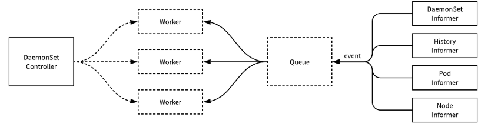

## 1 DaemonSet

Deployment 是 Kubernetes 中用于处理无状态服务的资源，而 StatefulSet 是用于支持有状态服务的资源。

DaemonSet 确保全部（或者某些）节点上运行一个 Pod 的副本，并且最多只能运行一个副本。与DaemonSet不一样的是，Deployment部署的副本Pod会分布在各个Node。

当有节点加入集群时，DaemonSet会为他们新增一个 Pod 。 当有节点从集群移除时，这些 Pod 也会被回收。删除 DaemonSet 将会删除它创建的所有 Pod。

### 1.1 DaemonSet 的典型应用场景

DaemonSet 的典型应用场景有：
1. 在集群的每个节点上运行存储Daemon，比如glusterd 或 ceph；
2. 在每个节点上运行日志收集Daemon，比如 flunentd 或 logstash；
3. 在每个节点上运行监控Daemon，比如Prometheus Node Exporter 或 collectd

其实Kubernetes 也在用DaemonSet运行系统组件，执行 `kubectl get daemonset --namespace=kube-system`

DaemonSet kube-flannel-ds 和 kube-proxy 分别负责在每个节点上运行flannel 和 kube-proxy 组件。


因为flannel 和 kube-proxy 属于系统组件，需要在命令行中通过 `--namespace=kube-system` 指定namespace kube-system。若不指定，则只返回默认namespace default 中的资源。

### 1.2 通过kube-flannel-ds 学习

回忆一下，之前是如何部署flannel网络，我们执行了如下命令：

`sudo kubectl apply -f https://raw.githubusercontent.com/coreos/flannel/master/Documentation/kube-flannel.yml`

flannel 的DaemonSet 就定义在kube-flannel.yml 中，截取部分如下：
```yaml
apiVersion: apps/v1
kind: DaemonSet
metadata:
  name: kube-flannel-ds-amd64
  namespace: kube-system
  labels:
    tier: node
    app: flannel
spec:
  selector:
    matchLabels:
      app: flannel
  template:
    metadata:
      labels:
        tier: node
        app: flannel
    spec:
      hostNetwork: true
      serviceAccountName: flannel
      initContainers:
      - name: install-cni
        image: quay.io/coreos/flannel:v0.11.0-amd64
        command:
        - cp
        args:
        - -f
        - /etc/kube-flannel/cni-conf.json
        - /etc/cni/net.d/10-flannel.conflist
        volumeMounts:
        - name: cni
          mountPath: /etc/cni/net.d
        - name: flannel-cfg
          mountPath: /etc/kube-flannel/
      containers:
      - name: kube-flannel
        image: quay.io/coreos/flannel:v0.11.0-amd64
        command:
        - /opt/bin/flanneld
        args:
        - --ip-masq
        - --kube-subnet-mgr
        resources:
          requests:
            cpu: "100m"
            memory: "50Mi"
          limits:
            cpu: "100m"
            memory: "50Mi"
      volumes:
        - name: run
          hostPath:
            path: /run/flannel
        - name: cni
          hostPath:
            path: /etc/cni/net.d
        - name: flannel-cfg
          configMap:
            name: kube-flannel-cfg
```

* DaemonSet 必需字段 apiVersion、kind、metadata 和 spec 字段
* DaemonSet 配置文件的语法和结构与Deployment几乎完全一样，只是将kind 设置为DaemonSet。
* hostNetwork 指定Pod 直接使用的是Node网络，相当于docker run --network=host
* containers 与 initContainers 定义了运行flannel 服务的两个容器

### 1.3 实现原理

所有的 DaemonSet 都是由控制器负责管理的，与其他的资源一样，用于管理 DaemonSet 的控制器是 DaemonSetsController，该控制器会监听 DaemonSet、ControllerRevision、Pod 和 Node 资源的变动。


### 1.4 删除

与 Deployment、ReplicaSet 和 StatefulSet 一样，DaemonSet 的删除也会导致它持有的 Pod 的删除。

```bash
$ kubectl delete deployment kube-flannel-ds-amd64  --namespace kube-system

$ kubectl get pods --watch --namespace kube-system
```

### 参考：

* [DaemonSet - Kubernetes](https://kubernetes.io/zh/docs/concepts/workloads/controllers/daemonset/)
* CloudMan. 每天 5 分钟玩转 Kubernetes[M]. 清华大学出版社, 2018.
* [详解 Kubernetes DaemonSet 的实现原理](https://draveness.me/kubernetes-daemonset)