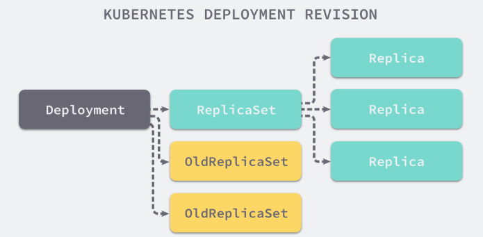

## 1 Deployment

首先，Kubernetes是通过各种Controller来管理Pod的生命周期的。为了满足不同的业务场景，Kubernetes提供了多种Controller，包括Deployment、ReplicaSet、DaemonSet、StatefulS、Job等。

### 1.1 运行Deployment

让我们先从一个例子开始，运行一个Deployment（使用命令）：
```bash
$ kubectl run nginx-deployment --image=nginx:1.7.9 --replicas=2

kubectl run --generator=deployment/apps.v1 is DEPRECATED and will be removed in a future version. Use kubectl run --generator=run-pod/v1 or kubectl create instead.
deployment.apps/nginx-deployment created
```
上面的命令将部署包含两个副本的Deployment nginx-deployment，容器的image 为NGINX：1.7.9

* 查看nginx-deployment的状态：

    `kubectl get deployment nginx-deployment`

    显示两个副本正常运行

    

* 查看nginx-deployment的详细信息：

    `kubectl describe deployment nginx-deployment`

    

    大部分内容都是自解释的，红框中的内容，告诉我们创建了一个ReplicaSet nginx-deployment-8476d5f8cd，Events是Deployment的日志，记录了ReplicaSet的启动过程。

    **这也验证了Deployment通过ReplicaSet来管理Pod的事实。**

* 查看ReplicaSet的状态：

    `kubectl get replicaset`

    两个副本已经就绪

    

* 查看ReplicaSet的详细信息：

    `kubectl describe replicaset nginx-deployment-8476d5f8cd`

    

    Controlled By 指明此ReplicaSet是由Deployment nginx-deployment 创建的。红框中显示的是两个副本Pod创建的日志。

* 查看Pod状态信息：

    `kubectl get pod`   **or**

    `kubectl get pods -l run=nginx-deployment`

    两个Pod都处于Running的状态
    
    

* 查看一个Pod的详细信息

    `kubectl describe pod nginx-deployment-8476d5f8cd-59frd`

    
    

    Controlled By 指明此Pod 是由ReplicaSet nginx-deployment-8476d5f8cd 创建的，Events记录了Pod的启动过程。如果操作失败（比如image不存在），也能在这里查到原因。

* 总结
    1. 用户通过kubectl 创建Deployment
    2. Deployment 创建 ReplicaSet
    3. ReplicaSet 创建 Pod


### 1.2 命令 VS 配置文件

Kubernetes 支持两种创建资源的方式
1. 用kubectl 命令直接创建
   * 简单、直观、快捷，上手快
   * 适合临时测试或实验
2. 通过配置文件和kubectl apply 创建
   * 配置文件描述了应用最终要达到的状态
   * 配置文件提供了创建资源的模板，能够重复部署
   * 可以像管理代码一样管理部署
   * 适合正式的、跨环境的、规模化部署
   * 这种方式要求熟悉配置文件的语法，有一定的难度
  
### 1.3 Deployment 配置文件

以nginx-deployment 为例，配置文件如下图所示(nginx.yml)：

```yaml
apiVersion: apps/v1
kind: Deployment
metadata:
  name: nginx-deployment
  labels:
    app: nginx
spec:
  replicas: 2 # tells deployment to run 2 pods matching the template
  selector:
    matchLabels:
      app: nginx
  template: # create pods using pod definition in this template
    metadata:
      # unlike pod-nginx.yaml, the name is not included in the meta data as a unique name is generated from the deployment name
      labels:
        app: nginx
    spec:
      containers:
      - name: nginx
        image: nginx:1.7.9
        ports:
        - containerPort: 80
```

1. apiVersion 是当前配置格式的版本
2. kind 是要创建的资源类型
3. metadata 是该资源的元数据，**name**是必须的元数据项
4. spec 部分是该Deployment 的规格说明
5. replicas 表明副本数量，默认为1
6. template 定义Pod的模板，这是配置文件的重要部分
7. metadata 定义Pod的元数据，至少要定义一个label。label的key和value可以任意指定
8. spec 描述Pod的规格，此部分定义Pod中每一个容器的属性，name和image是必须的

执行 `kubectl apply -f nginx.yml`

如果要删除创建的资源，执行 `kubectl delete deployment nginx-deployment` 或者 `kubectl delete -f nginx.yml`

### 1.4 更新Deployment

我们可以通过更新一个新的yaml文件来更新Deployment，下面的yaml文件(nginx-update.yml)指定该Deployment镜像更新为nginx 1.8
```yaml
apiVersion: apps/v1
kind: Deployment
metadata:
  name: nginx-deployment
  labels:
    app: nginx
spec:
  replicas: 2
  selector:
    matchLabels:
      app: nginx
  template:
    metadata:
      labels:
        app: nginx
    spec:
      containers:
      - name: nginx
        image: nginx:1.8 # Update the version of nginx from 1.7.9 to 1.8
        ports:
        - containerPort: 80
```

1. 应用新的yaml： `kubectl apply -f nginx-update.yml`
2. 查看该Deployment创建的Pods： `kubectl get pods -l run=nginx-deployment`

### 1.5 伸缩

伸缩 指的是在线增加或者减少Pod 的副本数。

我们通过应用新的yaml文件来增加Deployment中pods的数量。 下面的yaml文件(nginx-update-pod.yml)将replicas设置为4, 指定该Deployment应有4个pods:

```yaml
apiVersion: apps/v1
kind: Deployment
metadata:
  name: nginx-deployment
spec:
  replicas: 4 # Update the replicas from 2 to 4
  template:
    metadata:
      labels:
        app: nginx
    spec:
      containers:
      - name: nginx
        image: nginx:1.8
        ports:
        - containerPort: 80
```

1. 应用新的yaml： `kubectl apply -f nginx-update-pod.yml`
2. 验证Deployment有4个pods： `kubectl get pods -l run=nginx-deployment`

### 1.6 滚动更新

Deployment 的另一个更新策略 RollingUpdate 其实更加常见，将刚刚保存的yaml文件中的nginx镜像修改为nginx:1.8，然后在spec下面添加滚动升级策略：
```yaml
minReadySeconds: 5
strategy:
  # indicate which strategy we want for rolling update
  type: RollingUpdate
  rollingUpdate:
    maxSurge: 1
    maxUnavailable: 1
```

* minReadySeconds:
  * Kubernetes在等待设置的时间后才进行升级
  * 如果没有设置该值，Kubernetes会假设该容器启动起来后就提供服务了
  * 如果没有设置该值，在某些极端情况下可能会造成服务不正常运行
* maxSurge:
  * 升级过程中最多可以比原先设置多出的POD数量 
  * 例如：maxSurage=1，replicas=5,则表示Kubernetes会先启动1一个新的Pod后才删掉一个旧的POD，整个升级过程中最多会有5+1个POD。
* maxUnavaible:
  * 升级过程中最多有多少个POD处于无法提供服务的状态
  * 当maxSurge不为0时，该值也不能为0
  * 例如：maxUnavaible=1，则表示Kubernetes整个升级过程中最多会有1个POD处于无法服务的状态。

1. 更新

    `kubectl apply -f nginx-deployment.yaml`

2. 状态查看

     * 查看状态： `kubectl rollout status deployment/nginx-deployment`
     * 暂停升级： `kubectl rollout pause deployment <deployment>`
     * 继续升级： `kubectl rollout resume deployment <deployment>`

3. 升级结束后，继续查看rs的状态

    `kubectl get rs`


### 1.7 回滚Deployment

如果升级后的Pod出了问题该怎么办？我们能够想到的最好最快的方式当然是回退到上一次能够提供正常工作的版本，Kubernetes 中的每一个 Deployment 资源都包含有 revision 这个概念，版本的引入可以让我们在更新发生问题时及时通过 Deployment 的版本对其进行回滚。

Deployment 资源在规格中由一个 .**spec.revisionHistoryLimit** 的配置，这个配置决定了 Kubernetes 会保存多少个 ReplicaSet 的历史版本，这些历史上的 ReplicaSet 并不会被删除，它们只是不再持有任何的 Pod 副本了，假设我们有一个 .spec.revisionHistoryLimit=2 的 Deployment 对象，那么当前资源最多持有两个历史的 ReplicaSet 版本：


1. 首先，可以查看Deployment的升级历史

  ```bash
  $ kubectl rollout history deployment nginx-deployment

  deployments "nginx-deployment"
  REVISION  CHANGE-CAUSE
  1   <none>
  2   <none>
  3   kubectl apply --filename=nginx-deployment.yaml --record=true
  ```

2. 回退到当前版本的前一个版本

  ```bash
  $ kubectl rollout undo deployment nginx-deployment

  deployment "nginx-deployment" rolled back
  ```
3. 用revision回退到指定的版本

  ```bash
  $ kubectl rollout undo deployment nginx-deployment --to-revision=2

  deployment "nginx-deployment" rolled back
  ```


### 1.8 删除Deployment

* 通过名称删除 `kubectl delete deployment nginx-deployment` 或者 
* 通过删除yaml文件删除 `kubectl delete -f nginx**.yml`

### 1.9 Failover

模拟 Node1(lhm-cluster-test-w-0) 故障，关闭该节点。

等待一段时间，Kubernetes会检查到该节点不可用，将其上的Pod标记为Unknown状态，并在其他Node 上新创建一个Pod，维持总的副本数为2。


(这里检测到其关机Terminating)

当 Node1 恢复后，Unknown的Pod会被删除，不过已经运行的Pod不会重新调度到 Node1 上。


### 1.10 用label控制 Pod 的位置

默认配置下，Scheduler 会将 Pod 调度到所有可用的Node。但在有些情况下，我们希望将 Pod 部署到指定的Node，比如将有大量磁盘I/O 的Pod 部署到配置了 SSD 的 Node；或者Pod 需要运行在配置了GPU 的节点上。

Kubernetes 可以通过label来实现这个功能。

1. 使用label 将Node1 标注为是配置了SSD的节点
    
    `kubectl label node lhm-cluster-test-w-0 disktype=ssd`

2. 查看节点的label

    `kubectl get node --show-labels `

   

3. 指定将Pod 部署到Node1

    ```yaml
    apiVersion: apps/v1
    kind: Deployment
    metadata:
      name: nginx-deployment
      labels:
        app: nginx
    spec:
      replicas: 2
    selector:
      matchLabels:
        app: nginx
    template:
        metadata:
          labels:
            app: nginx
        spec:
          containers:
          - name: nginx
            image: nginx:1.7.9
            ports:
            - containerPort: 80
          nodeSelector:
            disktype: ssd
    ```

4. 查看Pod，可以看到全部副本都运行在Node1上，符合预期。
5. 要删除 label disktype，执行
   `kubectl lable node lhm-cluster-test-w-0 disktype-`
   不过此时Pod 依然不会重新部署，仍在Node1 上运行，除非在yaml文件中删除nodeSelector设置，并通过`kubectl apply -f `重新部署。

### 参考：

* [Deployments - Kubernetes](https://kubernetes.io/docs/concepts/workloads/controllers/deployment/)
* CloudMan. 每天 5 分钟玩转 Kubernetes[M]. 清华大学出版社, 2018.
* [Deployment的使用](https://www.qikqiak.com/k8s-book/docs/24.Deployment%20%E4%BD%BF%E7%94%A8.html)
* [详解 Kubernetes Deployment 的实现原理](https://draveness.me/kubernetes-deployment#)
