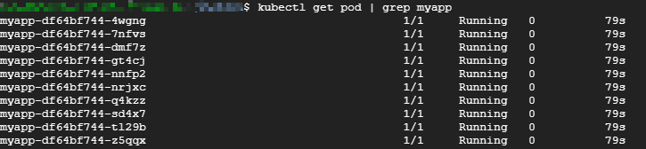
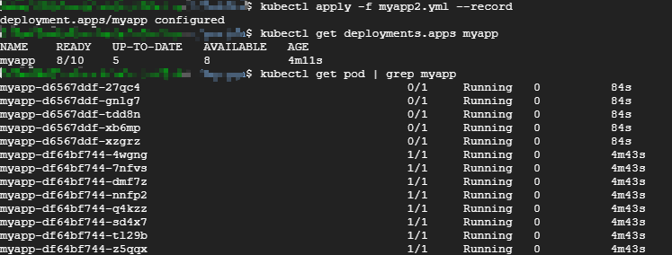
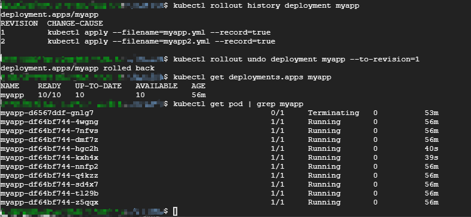

## Health Check在滚动更新中的应用

Health Check 另一个重要的应用场景是`Rolling Update`。试想一下，现有一个正常运行的多副本应用，接下来对应用进行更新（比如使用更高版本的image），Kubernetes会启动新副本，然后发生了如下事件：

1. 正常情况下新副本需要10秒钟完成准备工作，在此之前无法响应业务请求
2. 由于人为配置错误，副本始终无法完成准备工作（比如无法连接后端数据库）。

如果没有配置`Health Check`，会出现怎样的情况？

由于新副本本身没有异常退出，默认的`Health Check` 机制会认为容器已经就绪，进而会逐步用新副本替换现有副本，其结果就是：当所有就副本都被替换后，整个应用将无法处理请求，无法对外提供服务。如果这是发生在重要的生产系统上，后果会非常严重。

如果正确配置了`Health Check`，新副本只有通过了`Readiness` 探测才会被添加到`Service`；如果没有通过探测，现有副本不会被全部替换，业务仍然正常进行。

下面通过例子来实践`Health Check` 在 `Rolling Update` 中的应用。

使用如下配置文件`myapp.yml` 模拟一个`10 副本`的应用：

```yaml
apiVersion: apps/v1
kind: Deployment
metadata:
  name: myapp
spec:
  replicas: 10
  selector:
    matchLabels:
      app: myapp
  template:
    metadata:
      labels:
        app: myapp
    spec:
      containers:
      - name: myapp
        image: busybox
        args:
        - /bin/sh
        - -c
        - sleep 10; touch /tmp/healthy; sleep 30000
        readinessProbe:
          exec:
            command:
            - cat
            - /tmp/healthy
          initialDelaySeconds: 10
          periodSeconds: 5
```

10秒后副本能够通过`Readiness`探测。



接来下滚动更新应用，配置文件`myapp2.yml`：

```yaml
apiVersion: apps/v1
kind: Deployment
metadata:
  name: app
spec:
  replicas: 10
  selector:
    matchLabels:
      app: app
  template:
    metadata:
      labels:
        app: app
    spec:
      containers:
      - name: app
        image: busybox
        args:
        - /bin/sh
        - -c
        - sleep 30000
        readinessProbe:
          exec:
            command:
            - cat
            - /tmp/healthy
          initialDelaySeconds: 10
          periodSeconds: 5
```

很显然，由于新副本中不存在 `/tmp/healthy`， 因此是无法通过Readiness 探测的:



这个截图包含了大量的信息，值得我们详细分析：

先关注`kubectl get pod | grep myapp`的输出:

1. 从Pod的`AGE`栏可判断，最开始的5个Pod是新副本，目前处于 `NOT READY` 状态。
2. 旧副本从最初10个减少到8个。

再来看 `kubectl get deployment myapp` 的输出：

1. `READY 8/10` 表示期望的状态是10个 READY 的副本，实际处于READY状态的副本数是8，即8个旧副本
2. `UP-TO-DATE 5` 表示当前已经完成更新的副本数，即5个新副本
3. `AVAILABLE 8` 表示当前处于 READY 状态的副本数为8，即8个旧副本

在我们的设定中，新副本始终都无法通过Readiness探测，所以这个状态会一直保持下去。

上面我们模拟了一个滚动更新失败的场景。不过幸运的是：Health Check 帮我们屏蔽了有缺陷的副本，同时保留了大部分旧副本，业务没有因更新失败受到影响。

**接下来，为什么新创建的副本数是5个，同时只销毁了2个旧副本？**

原因是：滚动更新通过参数 `maxSurge` 和 `maxUnavailable` 来控制副本替换的数量。之前[Deployment 1.6 滚动更新](../Deployment.md)有讲过。

## maxSurge

此参数控制滚动更新过程中，副本总数超过期望状态的上限，也就是最多可以比原先设置多出的POD数量。`maxSurge` 可以是具体的整数（比如`3`），也可以是百分比，向上取整。`maxSurge`默认值为`25%`。

在上面的例子中，副本总数最大值为`roundUp(10 + 10 * 25%) = 13`, 所以我们看到的副本数是13。

## maxUnavailable

此参数控制滚动更新过程中，不可用的副本相占期望状态的最大比例，也就是最多有多少个POD处于无法提供服务的状态。`maxUnavailable` 可以是具体的整数（比如`3`），也可以是百分比，向下取整。`maxUnavailable`默认值为`25%`。

在上面的例子中，可用的副本数至少要为`10 - roundDown(10 * 25%) = 8`, 所以我们看到`AVAILABLE` 是 `8`。


* `maxSurge` 值越大，初始创建的新副本数量就越多；
* `maxUnavailable` 值越大。初始销毁的旧副本数量就越多。

理想情况下，我们这个案例滚动更新的过程应该是这样的：
1. 创建 3 个新副本使副本总数达到 13 个；
2. 销毁 2 个旧副本使可用的副本数降到 8 个；
3. 当 2 个旧副本成功销毁后，再创建 2 个新副本，使副本总数保持为 13 个；
4. 当新副本通过`Readiness`探测后，会使可用副本数增加，超过 8；
5. 进而可以继续销毁更多的旧副本，使可用副本数回到 8。
6. 旧副本的销毁使副本总数低于 13，这样就允许创建更多的新副本；
7. 这个过程会持续进行，最终所有的旧副本都会被新副本替换，滚动更新完成。

而实际情况是在第 4 步就卡住了，新副本无法通过 `Readiness` 探测。这个过程可以在 `kubectl describe deployment myapp` 的日志部分查看。

如果滚动更新失败，可以通过 `kubectl rollout undo` 回滚到上一个版本



如果要定制`maxSurge` 和 `maxUnavailable`，可以进行如下配置

```yaml
apiVersion: apps/v1
kind: Deployment
metadata:
  name: app
spec:
  strategy:
    type: RollingUpdate
    rollingUpdate:
      maxSurge: 35%
      maxUnavailable: 35%
  replicas: 10
  selector:
    matchLabels:
      app: app
  template:
    metadata:
      labels:
        app: app
    spec:
      containers:
      - name: app
        image: busybox
        args:
        - /bin/sh
        - -c
        - sleep 30000
        readinessProbe:
          exec:
            command:
            - cat
            - /tmp/healthy
          initialDelaySeconds: 10
          periodSeconds: 5
```