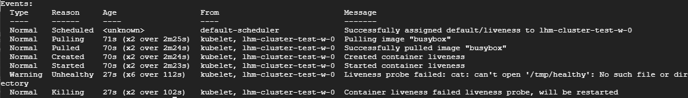

## Liveness

Liveness 探测让用户可以自定义判断容器是否健康的条件。如果探测失败，Kubernetes就会重启容器。

下面举例说明，创建如下Pod：

```yaml
apiVersion: v1
kind: Pod
metadata:
  name: liveness
  labels:
    test: liveness
spec:
  restartPolicy: OnFailure
  containers:
  - name: liveness
    image: busybox
    args:
    - /bin/sh
    - -c
    - touch /tmp/healthy; sleep 30; rm -rf /tmp/healthy; sleep 600
    livenessProbe:
      exec:
        command:
        - cat
        - /tmp/healthy
      initialDelaySeconds: 10
      periodSeconds: 5
```

启动进程首先创建文件`/tmp/healthy`, 30 秒后删除，在我们的设定中，如果`/tmp/health` 文件存在，则认为容器处于正常状态，反之则发生故障。

livenessProbe 部分 定义如何执行Liveness探测：

1. 探测的方法是：通过`cat` 命令检查`/tmp/healthy` 文件是否存在。如果命令执行成功，则返回值为零，Kubernetes 则认为本次 Liveness 探测成功；如果命令返回值非零，本次Liveness探测失败。
2. initialDelaySeconds：10 指定容器启动10秒之后开始执行Liveness探测，我们一般会根据应用启动的准备时间来设置。比如某个应用正常启动要花30秒，那么`initialDelaySeconds` 的值就应该大于`30`。 
3. periodSeconds：5 指定每5秒执行一次Liveness探测。Kubernetes如果连续执行3次Liveness探测均失败，则会杀掉并重启容器




从配置文件可知，最开始的30秒，`/tmp/healthy` 存在，`cat`命令返回`0`，Liveness探测成功，这段时间 `kubectl describe pod liveness` 的 `Events`部分会显示正常的日志。

35秒之后，日志会显示`/tmp/healthy` 已经不存在，Liveness探测失败，再过几十秒，几次探测都失败后，容器会被重启。