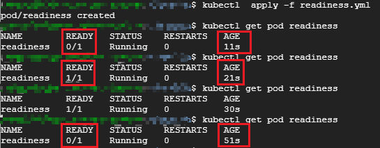
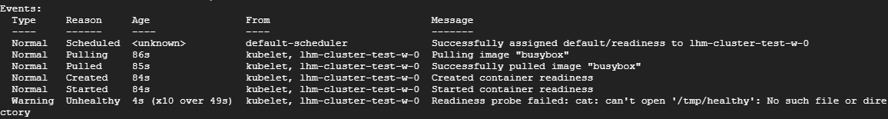

## Readiness

除了`Liveness`探测，`Kubernetes Health Check` 机制还包括 `Readiness` 探测。

用户通过Liveness探测可以告诉Kubernetes 什么时候通过重启容器实现自愈；Readiness 探测则是告诉Kubernetes 什么时候可以将容器加入到Service负载均衡池中，对外提供服务。

Readiness 探测的配置语法与 Liveness 探测完全一样，如下：

```yaml
apiVersion: v1
kind: Pod
metadata:
  name: readiness
  labels:
    test: readiness
spec:
  restartPolicy: OnFailure
  containers:
  - name: readiness
    image: busybox
    args:
    - /bin/sh
    - -c
    - touch /tmp/healthy; sleep 30; rm -rf /tmp/healthy; sleep 600
    readinessProbe:
      exec:
        command:
        - cat
        - /tmp/healthy
      initialDelaySeconds: 10
      periodSeconds: 5
```

这个配置文件只是将前面例子中的`liveness` 替换为了`readiness`。



Pod readiness 的 `READY` 状态经历了如下变化：

1. 刚被创建时，`READY` 状态为不可用；
2. `15` 秒后（`initialDelaySeconds + periodSeconds`），第一次进行Readiness探测并成功返回，设置`READY` 为可用；
3. `30` 秒后，`/tmp/healthy` 被删除，连续 `3` 次Readiness探测均失败后，`READY` 被设置为不可用。

通过`kubectl describe pod readiness` 也可以看到Readiness 探测失败的日志：

