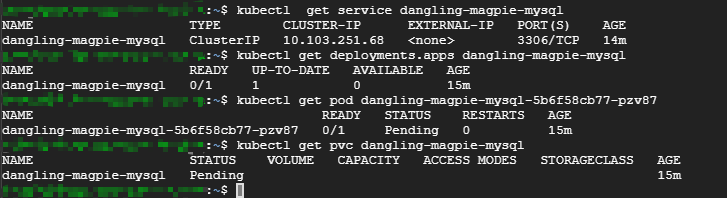

## 1 Helm 使用

### 1.1 当前可安装的chart

Helm 安装成功后，可以执行 `helm search` 查看当前可安装的chart。

Helm 可以像 `apt` 和 `yum` 管理软件包一样管理`chart`。`apt` 和 `yum` 的软件包存放在仓库中，同样的，Helm也有仓库

```sh
$ helm repo list 

NAME    URL                                             
stable  https://kubernetes-charts.storage.googleapis.com
local   http://127.0.0.1:8879/charts  
```

Helm 安装时已经默认配置好了两个仓库：`stable` 和 `local`。`stable` 是官方仓库，`local` 是用户存放自己开发的`chart`的本地仓库。

`helm search` 会显示`chart`位于哪个仓库，比如 `local/cool-chart` 和 `stable/acs-engine-autoscaler`。

### 1.2 添加仓库

我们可以通过`helm repo add` 添加更多的仓库，比如企业的私有仓库，仓库的管理和维护方法参考官网：https://helm.sh/docs/

### 1.3 关键字搜索

与 `apt` 和 `yum` 一样，`helm` 也支持关键字搜索

```bash
$ helm search mysql

NAME                                    CHART VERSION   APP VERSION     DESCRIPTION                                                 
stable/mysql                            1.4.0           5.7.27          Fast, reliable, scalable, and easy to use open-source rel...
stable/mysqldump                        2.6.0           2.4.1           A Helm chart to help backup MySQL databases using mysqldump 
stable/prometheus-mysql-exporter        0.5.1           v0.11.0         A Helm chart for prometheus mysql exporter with cloudsqlp...
stable/percona                          1.2.0           5.7.17          free, fully compatible, enhanced, open source drop-in rep...
stable/percona-xtradb-cluster           1.0.2           5.7.19          free, fully compatible, enhanced, open source drop-in rep...
stable/phpmyadmin                       4.0.0           4.9.1           phpMyAdmin is an mysql administration frontend              
stable/gcloud-sqlproxy                  0.6.1           1.11            DEPRECATED Google Cloud SQL Proxy                           
stable/mariadb                          6.12.0          10.3.18         Fast, reliable, scalable, and easy to use open-source rel...
```

### 1.4 显示已经部署的release

```bash
$ helm list
```

### 1.5 删除release

```bash
$ helm delete <your-release-name>
```

由于 Helm 保留已删除 release 的记录，因此不能重新使用 release 名称。如果要彻底删除 release，则需要加上 `--purge`参数

```bash
$ helm delete <your-release-name> --purge
```

### 1.6 安装chart

```sh
$ helm install stable/mysql
Error: no available release name found
```

如果报如上错误，通常是因为Tiller服务器的权限不足,执行如下命令添加权限：

```sh
$ kubectl create serviceaccount --namespace kube-system tiller

serviceaccount/tiller created

$ kubectl create clusterrolebinding tiller-cluster-rule --clusterrole=cluster-admin --serviceaccount=kube-system:tiller

clusterrolebinding.rbac.authorization.k8s.io/tiller-cluster-rule created

$ kubectl patch deploy --namespace kube-system  tiller-deploy -p '{"spec":{"template":{"spec":{"serviceAccount":"tiller"}}}}' 

deployment.apps/tiller-deploy patched
```

再次执行

```sh
$ helm install stable/mysql

NAME:   dangling-magpie
LAST DEPLOYED: Thu Oct 24 09:42:23 2019
NAMESPACE: default
STATUS: DEPLOYED

RESOURCES:
==> v1/ConfigMap
NAME                        DATA  AGE
dangling-magpie-mysql-test  1     0s

==> v1/Deployment
NAME                   READY  UP-TO-DATE  AVAILABLE  AGE
dangling-magpie-mysql  0/1    1           0          0s

==> v1/PersistentVolumeClaim
NAME                   STATUS   VOLUME  CAPACITY  ACCESS MODES  STORAGECLASS  AGE
dangling-magpie-mysql  Pending  0s      Filesystem

==> v1/Pod(related)
NAME                                    READY  STATUS   RESTARTS  AGE
dangling-magpie-mysql-5b6f58cb77-pzv87  0/1    Pending  0         0s

==> v1/Secret
NAME                   TYPE    DATA  AGE
dangling-magpie-mysql  Opaque  2     0s

==> v1/Service
NAME                   TYPE       CLUSTER-IP     EXTERNAL-IP  PORT(S)   AGE
dangling-magpie-mysql  ClusterIP  10.103.251.68  <none>       3306/TCP  0s


NOTES:
MySQL can be accessed via port 3306 on the following DNS name from within your cluster:
dangling-magpie-mysql.default.svc.cluster.local

To get your root password run:

    MYSQL_ROOT_PASSWORD=$(kubectl get secret --namespace default dangling-magpie-mysql -o jsonpath="{.data.mysql-root-password}" | base64 --decode; echo)

To connect to your database:

1. Run an Ubuntu pod that you can use as a client:

    kubectl run -i --tty ubuntu --image=ubuntu:16.04 --restart=Never -- bash -il

2. Install the mysql client:

    $ apt-get update && apt-get install mysql-client -y

3. Connect using the mysql cli, then provide your password:
    $ mysql -h dangling-magpie-mysql -p

To connect to your database directly from outside the K8s cluster:
    MYSQL_HOST=127.0.0.1
    MYSQL_PORT=3306

    # Execute the following command to route the connection:
    kubectl port-forward svc/dangling-magpie-mysql 3306

    mysql -h ${MYSQL_HOST} -P${MYSQL_PORT} -u root -p${MYSQL_ROOT_PASSWORD}
```

输出分为三个部分
1. chart 本次部署的描述信息（RESOURCES前）
   
    * NAME 是`release`的名字，因为没有用 `-n` 参数指定，所以Helm随机生成了一个，这里是`dangling-magpie`
    * NAMESPACE 是`release`部署的`namespace`，默认是`default`，也可以通过`--namespace` 指定
    * STATUS 为 `DEPLOYED`，表示已经将`chart`部署到集群。

2. 当前release包含的资源
     
     ConfigMap、Deployment、PersistentVolumeClaim、Pod、Secret、Service，其中Deployment、PersistentVolumeClaim、Secret和Service的名字都是`dangling-magpie-mysql`，命名格式为`ReleaseName-ChartName`

3. NOTE部分显示的是release的使用方法，比如：

    * 如何访问Service
    * 如何获取数据库密码
    * 如何连接数据库

通过 `kubectl get` 可以查看组成release的各个对象



由于我们还没有准备PersistentVolume，所以当前release还不可用。

`helm list` 显示已经部署的release

### 1.7 查看 chart 上可配置的选项

    ```sh
    $ helm inspect values stable/mysql
    ```