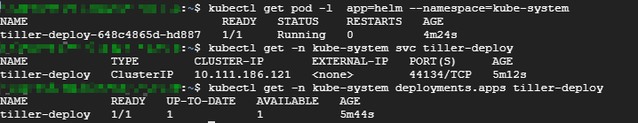

## 1 Helm 客户端安装

在[Helm Realese](https://github.com/helm/helm/releases)下载二进制文件，这里下载**v2.15.1** 版本
```sh
$ wget https://get.helm.sh/helm-v2.15.1-linux-amd64.tar.gz
$ tar -zxvf helm-v2.15.1-linux-amd64.tar.gz
$ sudo cp linux-amd64/helm /usr/local/bin/helm
$ helm version

Client: &version.Version{SemVer:"v2.15.1", GitCommit:"cf1de4f8ba70eded310918a8af3a96bfe8e7683b", GitTreeState:"clean"}
Error: could not find tiller
```

目前只能查看到客户端的版本，服务器还没有安装。

helm有很多子命令和参数，为了提高使用命令行的效率，建议安装helm 的 bash 命令补全脚本。

```bash
$ echo "source <(helm completion bash)" >> ~/.bashrc
$ helm 

completion  dependency  history     inspect     list        repo        search      template    verify      
create      fetch       home        install     package     reset       serve       test        version     
delete      get         init        lint        plugin      rollback    status      upgrade  
```

## 2 Tiller 服务器安装

Tiller 服务器安装非常简单，只需要执行 `helm init` 即可。

```bash
$ helm init 

Tiller (the Helm server-side component) has been installed into your Kubernetes Cluster.

Please note: by default, Tiller is deployed with an insecure 'allow unauthenticated users' policy.
To prevent this, run `helm init` with the --tiller-tls-verify flag.
For more information on securing your installation see: https://docs.helm.sh/using_helm/#securing-your-helm-installation
```

Tiller 本身也是作为容器化应用运行在Kubernetes Cluster中的，默认被部署在kubernetes集群的kube-system命名空间下。



可以看到Tiller 的 Pod、Service 和 Deployment。

现在，`helm version` 已经可以查看到服务器的版本信息了。

```bash
$ helm version
Client: &version.Version{SemVer:"v2.15.1", GitCommit:"cf1de4f8ba70eded310918a8af3a96bfe8e7683b", GitTreeState:"clean"}
Server: &version.Version{SemVer:"v2.15.1", GitCommit:"cf1de4f8ba70eded310918a8af3a96bfe8e7683b", GitTreeState:"clean"}
```

## 参考

* [INSTALL HELM](https://helm.sh/docs/using_helm/#installing-helm)
* CloudMan. 每天 5 分钟玩转 Kubernetes[M]. 清华大学出版社, 2018.
* [HELM](https://helm.sh/docs/)