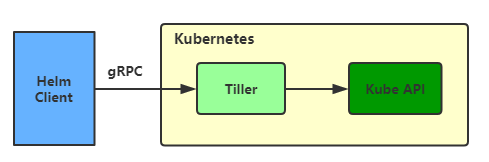

## 1 重要概念

* chart
  
    chart是创建一个应用的信息集合，包括各种Kubernetes对象的配置模板、参数定义、依赖关系、文档说明等。chart 是应用部署的自包含逻辑单元。可以将chart想象成apt、yum中的软件安装包。

* release

    release是chart的运行实例，代表了一个正在运行的应用。当chart被安装到Kubernetes 集群，就生成一个release。chart能够多次安装到同一个集群，每次安装都是一个release。

## 2 作用

1. 从零创建新chart
2. 与存储chart的仓库交互，拉取、保存和更新chart
3. 在Kubernetes集群中安装和卸载release
4. 更新、回滚和测试release。

## 3 Helm组件

Helm包含两个组件：Helm客户端和Tiller服务器。

* Helm客户端

    Helm客户端是终端用户使用的命令行工具，用户可以：

      1. 在本地开发chart
      2. 管理chart仓库
      3. 与Tiller服务器交互
      4. 在远程Kubernetes集群上安装chart
      5. 查看release信息
      6. 升级或卸载已有的release

* Tiller服务器

    Tiller 服务器运行在Kubernetes集群中，他会处理Helm客户端的请求，与Kubernetes API Server 交互。Tiller服务器负责：

      1. 监听来自Helm客户端的请求
      2. 通过chart构建release
      3. 在Kubernetes中安装chart，并跟踪release的状态
      4. 通过API Server升级或卸载已有的release