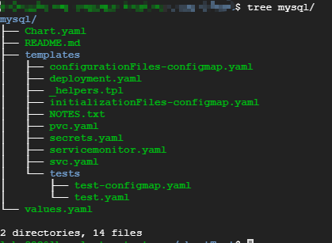
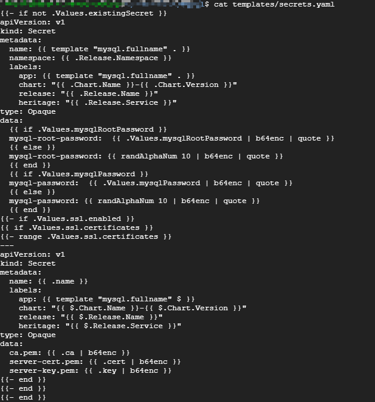
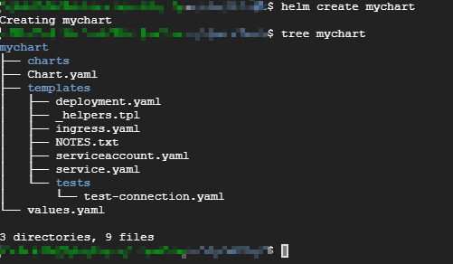

# 1 chart 详解

chart 是Helm的应用打包格式，由一系列文件组成，这些文件描述了Kubernetes 部署应用时所需要的资源，比如ConfigMap、Deployment、PersistentVolumeClaim、Secret、Service等。

单个的chart可以非常简单，只用于部署一个服务，比如`Memcached`。 chart也可以很复杂，部署整个应用，比如包含HTTP Servers、Database、消息中间件、Cache等。

chart将这些文件放置在预定义的目录结构中，通常整个chart被打包成tar包，并且标注上版本信息，便于Helm部署。

## 1.1 chart目录结构

一旦安装了某个`chart`，就可以在`~/.helm/cache/archive`中找到`chart` 的 `tar` 包，解压后，MySQL chart 目录结构如下：



目录名就是`chart` 的名字（不带版本信息）。

1. Chart.yaml

    YAML 文件，描述chart的概要信息。
    `name` 和 `version` 是必填项，其他都是可选项。

2. README.md

    Markdown 格式的README 文件，相当于chart的使用文档，此文件为可选。

3. LICENSE

    文本文件，描述chart的许可信息，此文件为可选。

4. requirements.yaml

    `chart` 可能依赖其他的`chart`，这些依赖关系可通过`requirements.yaml` 指定。在安装的过程中，依赖的chart也会被一起安装。

5. values.yaml

    `chart` 支持在安装时根据参数进行定制化配置，而`values.yaml` 则提供了这些配置参数的默认值。

6. templates目录

    各类`Kubernetes` 资源的配置模板都放置在这里。`Helm` 会将`values.yaml` 中的参数值注入模板中，生成标准的`YAML`配置文件。

    模板是`chart`最重要的部分，也是`Helm`最强大的地方。模板增加了应用部署的灵活性，能够适用于不同的环境。

7. templates/NOTES.txt

    chart 的简易使用文档，chart安装成功后会显示此文档内容。

    与模板一样，可以在NOTE.txt 中插入配置参数，Helm会动态注入参数值。

## 1.2 chart模板

Helm通过模板创建 Kubernetes 能够理解的 YAML 格式的资源配置文件。

以 templates/secrets.yaml 为例：



从结构上看，文件的内容非常像`Secret`配置，只是大部分属性值变成了`{{xxx}}`。这些`{{xxx}}` 实际上是模板的语法。`Helm` 采用了 `Go` 语言的模板来编写`chart`。

1. `{{ template "mysql.fullname" . }}` 是定义`Secret` 的`name`。关键字 `template`的作用是引用一个子模板 `mysql.fullname`。 这个子模板是在 `templates/_helpers.tpl` 文件中定义的。

```go
{{/* vim: set filetype=mustache: */}}
{{/*
Expand the name of the chart.
*/}}
{{- define "mysql.name" -}}
{{- default .Chart.Name .Values.nameOverride | trunc 63 | trimSuffix "-" -}}
{{- end -}}

{{/*
Create a default fully qualified app name.
We truncate at 63 chars because some Kubernetes name fields are limited to this (by the DNS naming spec).
If release name contains chart name it will be used as a full name.
*/}}
{{- define "mysql.fullname" -}}
{{- if .Values.fullnameOverride -}}
{{- .Values.fullnameOverride | trunc 63 | trimSuffix "-" -}}
{{- else -}}
{{- $name := default .Chart.Name .Values.nameOverride -}}
{{- if contains $name .Release.Name -}}
{{- printf .Release.Name | trunc 63 | trimSuffix "-" -}}
{{- else -}}
{{- printf "%s-%s" .Release.Name $name | trunc 63 | trimSuffix "-" -}}
{{- end -}}
{{- end -}}
{{- end -}}

{{/*
Generate chart secret name
*/}}
{{- define "mysql.secretName" -}}
{{ default (include "mysql.fullname" .) .Values.existingSecret }}
```

定义比较复杂。这里我们关注的重点是：如果存在一些信息多个模板都会用到，则可以在 `templates/_helpers.tpl` 文件中将其定义为子模板，然后通过templates函数引用。

这里 `mysql.fullname` 是由 `release` 与 `chart` 二者名字拼接组成的。

根据chart 的最佳实践，所有资源的名称都应该保持一致。

对于我们这个`chart`，无论`Secret`、`Deployment`、`PVC`还是`Service`，他们的名字都是子模板`mysql.fullname` 的值

2. Chart 和 Release 是Helm 预定义的对象，每个对象都有自己的属性，可以在模板中使用。如果使用下面的命令安装chart：

    ```sh
    $ helm install stable/mysql -n my
    ```

    * `{{ .Chart.Name }}` 的值为 `mysql`
    * `{{ .Chart.Version }}` 的值为 `1.4.0`
    * `{{ .Release.Name }}` 的值为 `my`
    * `{{ .Release.Service }}` 始终取值为 `Tiller`
    * `{{ template "mysql.fullname" $ }}` 计算结果为 `my-mysql`

3. `data`中使用`if-else` 的流控制 指定 `mysql-root-password`的值，逻辑为：如果`.Values.mysqlRootPassword` 有值就对其进行`base64` 编码，否则随机生成一个10位的字符串并编码。`Values` 也是预定义的对象，代表的是`values.yaml`文件。`.Values.mysqlRootPassword` 则是`values.yaml`中定义的`mysqlRootPassword` 参数。

    ```sh
    $ cat values.yaml | grep "mysqlRootPassword"
    # mysqlRootPassword: testing
    ```

    因为`mysqlRootPassword`被注释掉了，没有赋值，所以逻辑判断会走else，即随机生成密码。

    `randAlphaNum` 、`b64enc`、 `quote` 都是`Go` 语言支持的函数，函数之间可以通过管道 `|`连接，`{{ randAlphaNum 10 | b64enc | quote }}` 的作用是先随机产生一个长度为10 的字符串，然后将其`base64`编码，最后两边加上双引号。

无论多么复杂的应用，用户都可以用`Go`模板语言编写出`Chart`。无非是使用到更多的函数、对象和流控制。具体可参考官网文档 https://docs.helm.sh

## 1.3 再次实践MySQL chart

### 1.3.1 chart安装前的准备

[Helm使用](Helm使用.md)安装chart(1.6)部分，由于没有准备PersistentVolume，所以release `dangling-magpie-mysql` 还不可用。

通过 `helm inspect values stable/mysql` 查看 chart 上可配置的选项。输出的实际上是`values.yaml`的内容

先创建相应PV `mysql-pv`：

```yaml
apiVersion: v1
kind: PersistentVolume
metadata:
  name: mysql-pv
spec:
  accessModes:
    - ReadWriteOnce
  capacity:
    storage: 8Gi
  persistentVolumeReclaimPolicy: Retain
  nfs:
    path: /nfsdata/mysql-pv
    server: 10.138.0.34
```

通过 `kubectl apply -f mysql-pv.yml` 创建该PV，`kubectl get pv` 查看。

### 1.3.2 定制化安装chart

除了接受`values.yaml` 的默认值，我们还可以定制化`chart`，比如设置`mysqlRootPassword`。

Helm 传递配置参数的两种方式：

1. 指定自己的`values.yaml` 文件。通常的做法是首先通过`helm inspect values mysql > myvalues.yaml` 生成 `values` 文件，然后设置 `mysqlRootPassword` ，最后执行`helm install --values=myvalues.yaml mysql`
2. 通过 `--set` 直接传入参数值：

    `helm install stable/mysql --set mysqlRootPassword=abc123 -n my`

    `mysqlRootPassword` 设置为 `abc123`，`-n` 设置`release` 名称为 `my`，则各类资源的名称为 `my-mysql`。

通过 `helm list` 和 `helm status` 可以查看chart 的最新状态。

## 1.4 升级和回滚release 

release 发布后可以执行 `helm upgrade` 对其进行升级，通过`--values` 或 `--set` 应用新的配置，比如将当前的MySQL 版本升级到5.7.15：

`helm upgrade --set imageTag=5.7.15 my stable/mysql`

`helm history <release-name>` 可以查看release所有的版本。

通过`helm rollback <release-name> <release-version>` 可以回滚到任何版本。


## 1.5 定制chart

### 1.5.1 创建chart

执行 `helm create mychart`命令，创建chart `mychart`。



Helm 会帮我们创建目录`mychart`，并生成各类`chart`文件。我们可以在此基础上开发自己的`chart`。

### 1.5.2 调试chart

Helm提供了`debug` 的工具：`helm lint <chart-name>` 和 `helm install --dry-run <chart-name> --debug`。

`helm lint` 会检测`chart`的语法，报告错误以及给出建议。

`helm install --dry-run --debug` 会模拟安装`chart`，并输出每个模板生成的`YAML`内容。

### 1.5.3 安装chart

Helm安装chart的四种方法：

1. 安装仓库中的`chart`，例如 `helm install stable/nginx`.
2. 通过`tar`包安装，例如 `helm install nginx-1.2.3.tgz`.
3. 通过`chart`本地目录安装，例如 `helm insatll nginx`.
4. 通过`URL`安装，例如 `helm install https://example.com/charts/nginx-1.2.3.tgz`。

### 1.5.4 将chart添加到仓库

`chart` 通过测试后，可以添加到仓库中，团队其他成员就能够使用了。任何`HTTP Server` 都可以用作 `chart` 仓库。

1. 在`node1(10.138.0.36)`上启动一个httpd容器

    ```sh
    $ mkdir /www
    $ docker run -d -p 8080:80 -v /www/:/usr/local/apache2/htdocs/ httpd

    49db6003c28f0f6c372148c1d0cd70c431489a3be16870b4ba3785dae400226e
    ```

2. 通过 `helm package` 将 mychart 打包

    ```sh
    $ helm package mychart/

    Successfully packaged chart and saved it to: /home/mychart-0.1.0.tgz
    ```

3. 执行`helm repo index` 生成仓库的index文件  

    ```sh
    $ mkdir myrepo
    $ mv mychart-0.1.0.tgz myrepo/
    $ helm repo index myrepo/ --url http://10.138.0.36:8080/charts
    $ ls myrepo/

    index.yaml  mychart-0.1.0.tgz
    ```

    Helm 会扫描`myrepo` 目录中的所有`tgz` 包并生成`index.yaml`。 `--url` 指定的是新仓库的访问路径。新生成的`index.yaml` 记录了当前仓库中所有chart的信息。

    ```bash
    $ cat myrepo/index.yaml 
    
    apiVersion: v1
    entries:
      mychart:
      - apiVersion: v1
        appVersion: "1.0"
        created: "2019-10-25T03:21:43.935133424Z"
        description: A Helm chart for Kubernetes
        digest: ecd7c3fbd84e33a2e61c79adb7a6873a260e91bc645397f35ba59ec1be88e662
        name: mychart
        urls:
        - http://10.138.0.36:8080/charts/mychart-0.1.0.tgz
        version: 0.1.0
    generated: "2019-10-25T03:21:43.934345907Z"
    ```

    当前只有`mychart` 这一个 `chart`。

4. 将 `mychart-0.1.0.tgz` 和 `index.yaml` 上传到 `node1` 的 `/www/chart`目录
5. 通过`helm repo add` 将新仓库添加到Helm

    ```sh
    $ helm repo add newrepo http://10.138.0.36:8080/charts
    $ helm repo list
    ```

6. 已经可以直接从新仓库安装`mychart` 了

    ```sh
    $ helm install newrepo/mychart
    ```

7. 若以后仓库添加了新的`chart`，则需要用 `helm repo update` 更新本地的`index`，这个操作相当于`Ubuntu` 的 `apt-get update`