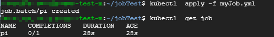
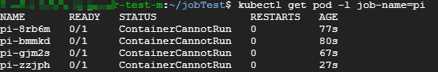
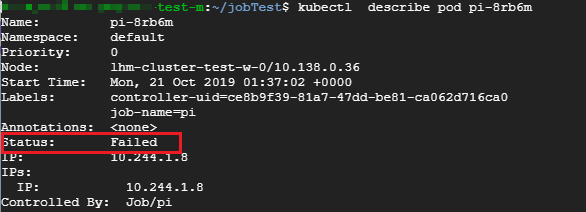
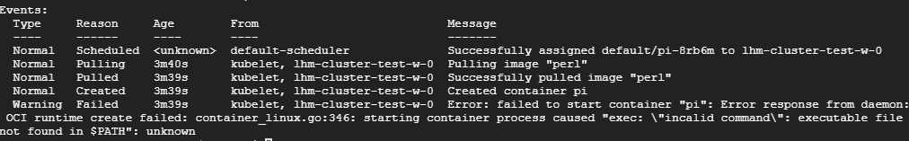
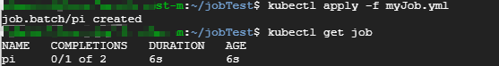
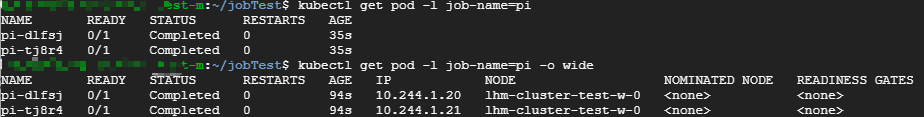
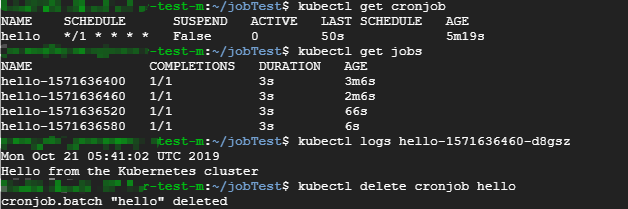

## 1 Job

容器按照持续运行的时间可分为两类：服务类容器和工作类容器

服务类容器通常持续提供服务，需要一直运行，如 HTTP Server、Daemon等。工作类容器则是一次性任务，比如批处理程序，完成后容器就退出。

Kubernetes 的 Deployment、ReplicaSet 和 DaemonSet 都用于管理服务类容器；对于工作类容器，则使用Job。

### 1.1 编写yaml文件

首先，我们看一个简单的Job配置文件myJob.yml：
```yaml
apiVersion: batch/v1
kind: Job
metadata:
  name: pi
spec:
  template:
    spec:
      containers:
      - name: pi
        image: perl
        command: ["perl",  "-Mbignum=bpi", "-wle", "print bpi(2000)"]
      restartPolicy: Never
  backoffLimit: 4
```

1. apiVersion: batch/v1 当前Job的版本为 batch/v1
2. kind: Job 指明当前资源的类型为Job
3. restartPolicy 指定什么情况下需要重启容器。对于Job，只能设置为Never或者OnFailure。对于其他controller（如Deployment），可以设置为Always。
4. backoffLimit 指定在将作业视为失败之前重试的次数，默认为6。
   
### 1.2 运行Job

* 运行Job：
  
    `kubectl apply -f myJob.yml`

* 查看job的状态：

    ```bash
    $ kubectl get job

    NAME   COMPLETIONS   DURATION   AGE
    pi     0/1           11s        11s
    ```

* 查看Pod状态：

    ```bash
    $ kubectl get pod -l job-name=pi

    NAME       READY   STATUS      RESTARTS   AGE
    pi-7c9vg   0/1     Completed   0          2m21s
    ```

* 查看job详细信息:

    ```bash
    $ kubectl describe jobs/pi
    ```
    

* 查看job运行结果

    ```bash
    $ kubectl logs pi-7c9vg 
    ```
    
    ```yaml
    3.1415926535897932384626433832795028841971693993751058209749445923078164062862089986280348253421170679821480865132823066470938446095505822317253594081284811174502841027019385211055596446229489549303819644288109756659334461284756482337867831652712019091456485669234603486104543266482133936072602491412737245870066063155881748815209209628292540917153643678925903600113305305488204665213841469519415116094330572703657595919530921861173819326117931051185480744623799627495673518857527248912279381830119491298336733624406566430860213949463952247371907021798609437027705392171762931767523846748184676694051320005681271452635608277857713427577896091736371787214684409012249534301465495853710507922796892589235420199561121290219608640344181598136297747713099605187072113499999983729780499510597317328160963185950244594553469083026425223082533446850352619311881710100031378387528865875332083814206171776691473035982534904287554687311595628638823537875937519577818577805321712268066130019278766111959092164201989380952572010654858632788659361533818279682303019520353018529689957736225994138912497217752834791315155748572424541506959508295331168617278558890750983817546374649393192550604009277016711390098488240128583616035637076601047101819429555961989467678374494482553797747268471040475346462080466842590694912933136770289891521047521620569660240580381501935112533824300355876402474964732639141992726042699227967823547816360093417216412199245863150302861829745557067498385054945885869269956909272107975093029553211653449872027559602364806654991198818347977535663698074265425278625518184175746728909777727938000816470600161452491921732172147723501414419735685481613611573525521334757418494684385233239073941433345477624168625189835694855620992192221842725502542568876717904946016534668049886272327917860857843838279679766814541009538837863609506800642251252051173929848960841284886269456042419652850222106611863067442786220391949450471237137869609563643719172874677646575739624138908658326459958133904780275901
    ```


### 1.3 Pod 失败的情况

修改myJob.yml，故意引入一个错误

```yaml
apiVersion: batch/v1
kind: Job
metadata:
  name: pi
spec:
  template:
    spec:
      containers:
      - name: pi
        image: perl
        command: ["invalid command",  "-Mbignum=bpi", "-wle", "print bpi(2000)"]
      restartPolicy: Never
  backoffLimit: 4
```

* 删除之前的Job: 

    `kubectl delete -f myJob.yml`

* 运行新的Job并查看状态:

    `kubectl get job pi`

    

* 查看Pod的状态

    `kubctl get Pod -l job-name=pi`

    

    可以看到有多个Pod，状态均为不正常

* 查看某个Pod的详细信息

    `kubectl describe pod pi-8rb6m`

    
    

    日志显示没有可执行程序，符合我们的预期。

**过程解释**：

    当第一个Pod启动时，容器失败退出，根据restartPolicy：Never，此失败容器不会被重启，再根据backoffLimit：4，我们设置的将作业视为失败之前，重试次数为4，所以Job controller会再启动新的Pod，而对于我们这个例子，Job永远不会成功，所以Job controller会一直创建新的Pod，知道创建个数为设定的4个，还未成功，则将作业视为失败，退出。


### 1.4 Job终止与删除

当作业完成后，不会再创建其他的Pod， 但是之前创建的Pod也不会被删除，保留他们，让你仍然可以查看已完成的Pod的日志，检查是否有错误、警告或者其他诊断输出。作业对象在完成之后也将保留下来，以便你可以查看其状态。

用户可以决定是否删除旧作业。使用`kubectl delect jobs ** ` 或者 `kubectl delect -f **.yml` 删除作业，当使用kubectl删除作业时，它创建的所有Pod 也将被删除

默认情况下，除非Pod失败（restartPolicy = Never）或者容器错误退出（restartPolicy = OnFailure），否则Job将不间断运行，此时Jon遵循.spec.backoffLimit, 一旦达到.spec.backoffLimit，作业将被标记为失败，并且所有正在运行的Pod都将终止。

终止工作的另一种方法是**设置有效期限**，通过设置作业的.**spec.activeDeadlineSeconds** 字段来实现。无论创建了多少个Pod，activeDeadlineSeconds 都适用于作业的持续时间，作业达到activeDeadlineSeconds后，将终止其所有正在运行的Pod，并且作业状态将变为：Failed，原因：DeadlineExceeded。

注意，作业的.spec.activeDeadlineSeconds 优先于 .spec.backoffLimit，因此，重试一个或多个失败Pod的Job，一旦达到activeDeadlineSeconds 指定的时间限制，就不会部署其他Pod，即使尚未达到backoffLimit。

```yaml
apiVersion: batch/v1
kind: Job
metadata:
  name: pi-with-timeout
spec:
  backoffLimit: 5
  activeDeadlineSeconds: 100
  template:
    spec:
      containers:
      - name: pi
        image: perl
        command: ["perl",  "-Mbignum=bpi", "-wle", "print bpi(2000)"]
      restartPolicy: Never
```

  
### 1.5 Job的并行性

我们可以通过设置parallelism 来控制同时运行的Pod 数，提高Job的执行效率。

修改myJob.yml，将parallelism 设置为2

```yaml
apiVersion: batch/v1
kind: Job
metadata:
  name: pi
spec:
  parallelism：2
  template:
    spec:
      containers:
      - name: pi
        image: perl
        command: ["perl",  "-Mbignum=bpi", "-wle", "print bpi(2000)"]
      restartPolicy: Never
  backoffLimit: 4
```

* 删除之前的Job: 

    `kubectl delete -f myJob.yml`
    
* 运行新的Job并查看状态:

    `kubectl get job pi`

    

* 查看Pod的状态

    `kubctl get Pod -l job-name=pi`

    

* 查看某个Pod的详细信息

    `kubectl describe pod pi-dlfsj`

Job 一共启动了两个Pod，并且age相同，可见是并行运行的。

我们还可以通过completions设置Job成功完成Pod 的总数：

下面配置的含义是：每次运行两个Pod，知道总共有6个Pod成功完成。

```yaml
apiVersion: batch/v1
kind: Job
metadata:
  name: pi
spec:
  completions：6
  parallelism：2
  template:
    spec:
      containers:
      - name: pi
        image: perl
        command: ["perl",  "-Mbignum=bpi", "-wle", "print bpi(2000)"]
      restartPolicy: Never
  backoffLimit: 4
```

### 1.6 CronJob

Kubernetes 的 CronJob 提供了定时执行Job 的功能。CronJob其实就是在Job的基础上加上了时间调度

```yaml
apiVersion: batch/v1beta1
kind: CronJob
metadata:
  name: hello
spec:
  schedule: "*/1 * * * *"
  jobTemplate:
    spec:
      template:
        spec:
          containers:
          - name: hello
            image: busybox
            args:
            - /bin/sh
            - -c
            - date; echo Hello from the Kubernetes cluster
          restartPolicy: OnFailure
```

1. batch/v1beta1 是当前CronJob的apiVersion
2. kind：CronJob 指明当前资源的类型为CronJob
3. schedule 指定什么时候运行Job，格式与Linux cron 一致，这里的"*/1 * * * *" 的含义是每一分钟启动一次。
4. jobTemplate 定义Job的模板，格式与之前的Job一致。

除了这些，还有一些值得关注的字段：

* .spec.successfulJobsHistoryLimit和.spec.failedJobsHistoryLimit，表示历史限制，是可选的字段。它们指定了可以保留多少完成和失败的Job。默认情况下，successfulJobsHistoryLimit 设置为 3，failedJobsHistoryLimit 设置为 1。如果设置限制的值为 0，那么相关类型的Job完成后将不会被保留。
* .spec.startingDeadlineSeconds 指示在 CronJob 由于某种原因错过了计划时间的情况下启动 CronJob 的截止时间（以秒为单位）。错过的 CronJob 被视作失败。
* .spec.concurrencyPolicy 指定如何处理 CronJob 控制器创建的作业的并发执行，concurrencyPolicy 接受以下值
  * Allow：允许并发作业。默认此值。
  * Forbid：如果之前的运行尚未完成，则禁止并发作业并跳过下一次运行。
  * Replace：取消当前正在运行的作业并将其替换为新作业。



可以看到每隔一分钟就会启动一个Job。

### 参考：
* [Jobs - Run to Completion](https://kubernetes.io/docs/concepts/workloads/controllers/jobs-run-to-completion/)
* [CronJob - Kubernetes](https://kubernetes.io/docs/concepts/workloads/controllers/cron-jobs/)
* [Running Automated Tasks with a CronJob](https://kubernetes.io/docs/tasks/job/automated-tasks-with-cron-jobs/)
* CloudMan. 每天 5 分钟玩转 Kubernetes[M]. 清华大学出版社, 2018.
* [CronJob - Google Cloud](https://cloud.google.com/kubernetes-engine/docs/how-to/cronjobs)