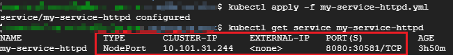
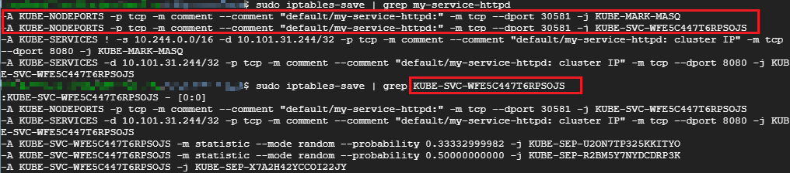

## 1 Kubernetes Service 详解

Kubernetes 中的 Pod 是有生命周期的对象，Deployment 等Controller 会通过动态创建和销毁Pod 来保证应用整体的健壮性。

每个Pod都有自己的IP地址，当Controller 用新的Pod替代发生故障的Pod时， 新的Pod 会分配到新的IP地址，那么，客户端是如何找到并访问这个服务呢？

答案就是Service，Kubernetes中，Service 是应用服务的抽象，定义了一组Pod的逻辑集合和访问这个Pod集合的策略方式。我们可以把Service 加上一组Pod 称作是一个微服务。

### 1.1 IP 

IP 类型 | 说明
---- | ---
Node IP | Node节点的IP地址
Pod IP |  Pod 的IP地址
Cluster IP | Service的IP地址

#### 1.1.1 Node IP

NodeIP是集群中每个节点的物理网卡IP地址，是真实存在的物理网络，kubernetes集群之外的节点访问kubernetes内的某个节点或TCP/IP服务的时候，需要通过NodeIP进行通信。

#### 1.1.2 Pod IP

Pod IP 是每个Pod的IP地址，是Docker Engine 根据docker0网桥的IP段地址进行分配的，是一个虚拟二层网络，集群中的一个Pod容器访问另一个Pod中的容器，是通过Pod IP进行通信的，而真实的TCP/IP 流量是通过Node IP所在的网卡流出的。

#### 1.1.3 Cluster IP

1. Service 的Cluster IP是一个虚拟IP，只作用于Service 这个对象，由Kubernetes 管理和分配IP地址（来源于Cluster IP地址池）。
2. Cluster IP 无法被ping通，因为没有一个实体网络对象来响应
3. Cluster IP 结合Service Port组成的具体通信端口才具备TCP/IP通信基础，属于Kubernetes集群内，而集群外访问该IP和端口需要额外处理
4. Kubernetes集群内Node IP、Pod IP、Cluster IP 之间的通信采取Kubernetes自己的特殊路由规则，与传统IP路由不同。

### 1.2 创建Service

Kubernetes Service 从逻辑上代表了一组Pod，具体是哪些Pod 则是由label 来挑选的。Service有自己的IP，而且这个IP是不变的。客户端只需要访问Service的IP，Kubernetes则负责建立和维护Service与Pod的映射关系。无论后端Pod如何变化，对客户端不会有任何影响，因为Service没有变。

Kubernetes中Service 是一个REST对象，类似于Pod。 像所有REST对象一样，你可以将Service的定义发布到API server 来创建一个新实例。

首先创建一个Deployment：

启动三个Pod，运行httpd镜像，label是 **app: httpd**, Service 将会用这个label来挑选Pod。

```yaml
apiVersion: apps/v1
kind: Deployment
metadata:
  name: httpd
  labels:
    app: httpd
spec:
  replicas: 3 
  selector:
    matchLabels:
      app: httpd
  template: 
    metadata:
      labels:
        app: httpd
    spec:
      containers:
      - name: httpd
        image: httpd
        ports:
        - containerPort: 80
```

可以看到，Pod分配了各自的 IP，但这些 IP 只能被Kubernetes Cluster 中的容器和节点访问。


接下来创建Service：

```yaml
apiVersion: v1
kind: Service
metadata:
  name: my-service-httpd
spec:
  selector:
    app: httpd
  ports:
    - protocol: TCP
      port: 8080
      targetPort: 80
```

1. Service 的 apiVersion 是 v1
2. kind 指明当前资源的类型是 Service
3. Service 的名字为 my-service-httpd
4. selector 指明挑选label为 app: httpd 的 Pod 作为Service的后端
5. 将Service 的8080 端口 映射到Pod 的80 端口，使用 TCP 协议

执行 `kubectl apply` 创建 Service my-service-httpd

my-service-httpd 分配到一个Cluster-IP 10.101.31.244。可以通过该IP访问后端的httpd Pod。根据前面的端口映射，使用8080端口。


使用`kubectl describe` 查看Service的详细信息。


其中 **Endpoints** 罗列了三个Pod的IP和端口。我们知道Pod的 IP 是在容器中配置的，那么Service的Cluster IP
又是配置在哪里的呢？Cluster-IP 又是如何映射到Pod IP 的呢？

答案是 **iptables**。

### 1.3 Cluster IP 的底层实现

Cluster IP 是一个虚拟IP，是由Kubernetes节点上的iptables规则管理的。

可以通过`sudo iptable-save` 命令打印出当前节点的iptables规则


这两条规则的含义是：
1. 如果Cluster 内的Pod （源地址来自10.244.0.0/16）要访问my-service-httpd，则允许
2. 其他源地址访问my-service-httpd，跳转到规则 KUBE-SVC-WFE5C447T6RPSOJS

KUBE-SVC-WFE5C447T6RPSOJS 规则如下:

> -A KUBE-SVC-WFE5C447T6RPSOJS -m statistic --mode random --probability 0.33332999982 -j KUBE-SEP-U2ON7TP325KKITYO
> 
> -A KUBE-SVC-WFE5C447T6RPSOJS -m statistic --mode random --probability 0.50000000000 -j KUBE-SEP-R2BM5Y7NYDCDRP3K
> 
> -A KUBE-SVC-WFE5C447T6RPSOJS -j KUBE-SEP-X7A2H42YCCOI22JY

1. 1/3 的概率跳转到规则KUBE-SEP-U2ON7TP325KKITYO
2. 1/3 的概率跳转到规则KUBE-SEP-R2BM5Y7NYDCDRP3K
3. 1/3 的概率跳转到规则KUBE-SEP-X7A2H42YCCOI22JY

上面三个跳转的规则如下：


即将请求分别转发到后端的三个Pod。

通过上面的分析，我们可以得到结论：**iptables将访问Service的流量转发到后端Pod，而且使用类似轮询的负载均衡策略。**

另外，Cluster的每一个节点都配置了相同的iptables 规则。

### 1.4 DNS访问Service

在Cluster中，除了可以通过Cluster IP访问Service, Kubernetes还提供了更为方便的DNS访问。

kubeadm 部署时会默认安装coredns组件,Cluster 中的Pod 可以通过<SERVICE_NAME>.<NAMESPACE_NAME>访问Service。

例如，可以用my-service-httpd.defalut 访问 Service my-service-httpd


如上图，在一个临时的busybox Pod 中验证了DNS 的有效性，另外，由于这个Pod与my-service-httpd 同属于default namespace，因此也可以省略default，直接用my-service-httpd 访问Service。

使用`exit` 退出

### 1.5 外网访问Service

除了Cluster内部可以访问Service，很多情况下，我们也希望应用的Service能够暴露给Cluster 外部。

Kubernetes 提供了多种Service 类型，默认是 ClusterIP 类型。

ServiceTypes：

1. ClusterIP：通过集群的内部 IP 暴露服务，服务只能够在集群内部可以访问，这也是默认的 ServiceType。
2. NodePort：通过每个 Node 上的 IP 和静态端口（NodePort）暴露服务。NodePort 服务会路由到 ClusterIP 服务，这个 ClusterIP 服务会自动创建。通过请求 <NodeIP>:<NodePort>，可以从集群的外部访问一个 NodePort 服务。
3. LoadBalancer：使用云提供商的负载均衡器，可以向外部暴露服务。外部的负载均衡器可以路由到 NodePort 服务和 ClusterIP 服务。
4. ExternalName：通过返回 CNAME 和它的值，可以将服务映射到 externalName 字段的内容（例如， foo.bar.example.com）。 没有任何类型代理被创建，这只有 Kubernetes 1.7 或更高版本的 kube-dns 才支持。

#### 1.5.1 NodePort

如果设置 type 的值为 "NodePort"，Kubernetes master 将从给定的配置范围内（默认：30000-32767）分配端口，每个 Node 将从该端口（每个 Node 上的同一端口）代理到 Service。该端口将通过 Service 的 spec.ports[*].nodePort 字段被指定，如果不指定的话会自动生成一个端口。

修改 Service my-service-httpd 的配置文件如下：（添加type: NodePort）

```yaml
apiVersion: v1
kind: Service
metadata:
  name: my-service-httpd
spec:
  selector:
    app: httpd
  type: NodePort
  ports:
    - protocol: TCP
      port: 8080
      targetPort: 80
```

重新创建该Service my-service-httpd：



Kubernetes依然会为my-service-httpd分配一个ClusterIP，不同的是：
1. TYPE 为 NodePort，表示可通过Cluster每个节点自身的IP访问Service。
2. PORT(S)为8080:30581/TCP。8080是ClusterIP监听的端口，30581 则是节点上监听的端口。Kubernetes会从30000 ~ 32767 中分配一个可用的端口，每个节点都会监听此端口并将请求转发给Service。


三个节点IP + 30581 端口，都能访问 my-service-httpd，NodePort正常工作。

Kubernetes 是如何将<NodeIP>:<NodePort>映射到Pod的呢？

答案也是 **iptables**。



访问当前节点30581 端口的请求会应用规则KUBE-SVC-WFE5C447T6RPSOJS，同ClusterIP。

NodePort默认是随机选择，我们也可以用nodePort指定某个特定端口：

```yaml
apiVersion: v1
kind: Service
metadata:
  name: my-service-httpd
spec:
  selector:
    app: httpd
  type: NodePort
  ports:
    - protocol: TCP
      nodePort: 30000
      port: 8080
      targetPort: 80
```

1. nodePort 是节点上监听的端口
2. port 是ClusterIP上监听的端口
3. targetPort 是Pod监听的端口

最终，Node 和 ClusterIP 在各自端口上接收到的请求都会通过iptables 转发到Pod 的 targetPort

#### 1.5.2 ExternalName

ExternalName 是 Service 的特例，它没有 selector，也没有定义任何的端口和 Endpoint。 对于运行在集群外部的服务，它通过返回该外部服务的别名这种方式来提供服务。

```yaml
kind: Service
apiVersion: v1
metadata:
  name: my-service
  namespace: prod
spec:
  type: ExternalName
  externalName: my.database.example.com
```

当查询主机 my-service.prod.svc.cluster.local （后面服务发现的时候我们会再深入讲解）时，集群的 DNS 服务将返回一个值为 my.database.example.com 的 CNAME 记录。 访问这个服务的工作方式与其它的相同，唯一不同的是重定向发生在 DNS 层，而且不会进行代理或转发。 如果后续决定要将数据库迁移到 Kubernetes 集群中，可以启动对应的 Pod，增加合适的 Selector 或 Endpoint，修改 Service 的 type，完全不需要修改调用的代码，这样就完全解耦了。


### 参考

* [Service- Kubernetes](https://kubernetes.io/docs/concepts/services-networking/service/)
* [详解 Kubernetes Service 的实现原理](https://draveness.me/kubernetes-service#)
* CloudMan. 每天 5 分钟玩转 Kubernetes[M]. 清华大学出版社, 2018.
* [Service](https://www.qikqiak.com/k8s-book/docs/27.Service.html)