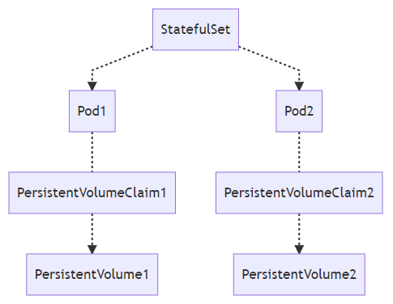

## 1 StatefulSet

StatefulSet 表示一组具有唯一持久身份和稳定主机名的 [Pod]。

在 Kubernetes 的世界中，ReplicaSet 和 Deployment 主要用于处理无状态的服务，无状态服务的需求往往非常简单并且轻量，每一个无状态节点存储的数据在重启之后就会被删除，虽然这种服务虽然常见，但是我们仍然需要有状态的服务来实现一些特殊的需求，StatefulSet 就是 Kubernetes 为了运行有状态服务引入的资源，例如 Zookeeper、Kafka 等。

### 1.1 创建 StatefulSet

使用 `kubectl apply -f **.yml` 来创建StatefulSet

```yaml
apiVersion: v1
kind: Service
metadata:
  name: nginx
  labels:
    app: nginx
spec:
  ports:
  - port: 80
    name: web
  clusterIP: None
  selector:
    app: nginx
---

apiVersion: apps/v1
kind: StatefulSet
metadata:
  name: [STATEFULSET_NAME]
spec:
  serviceName: [SERVICE_NAME]
  replicas: 3
  updateStrategy:
    type: RollingUpdate
  template:
    metadata:
      labels:
        app=[APP_NAME]
    spec:
      containers:
      - name: [CONTAINER_NAME]
        image: ...
        ports:
        - containerPort: 80
          name: [PORT_NAME]
        volumeMounts:
        - name: [PVC_NAME]
          mountPath: ...
  volumeClaimTemplates:
  - metadata:
      name: [PVC_NAME]
      annotations:
        ...
    spec:
      accessModes: [ "ReadWriteOnce" ]
      resources:
        requests:
          storage: 1Gi
```

1. [STATEFULSET_NAME] 是您为 StatefulSet 选择的名称
2. [SERVICE_NAME] 是您为 Service 选择的名称
3. [APP_NAME] 是您为 Pod 中运行的应用选择的名称
4. [CONTAINER_NAME] 是您为 Pod 中的容器选择的名称
5. [PORT_NAME] 是您为 StatefulSet 打开的端口选择的名称
6. [PVC_NAME] 是您为 PersistentVolumeClaim 选择的名称
7. template: spec: volumeMounts 指定一个名为 www 的 mountPath。mountPath 是容器中应装载存储卷的路径。
8. StatefulSet 预配了一个具有 1 GB 预配存储空间的 PersistentVolumeClaim：www。

在该文件中，kind 字段指定 StatefulSet 对象应该使用文件中定义的规范来创建。该示例 StatefulSet 生成三个副本 Pod，并打开端口 80 以向互联网公开 StatefulSet。

除此之外，上述 YAML 文件中的 **volumeClaimTemplates** 配置还会创建 **持久卷PersistentVolume** 和用于绑定持久卷和 Pod 的 PersistentVolumeClaim 资源；两个 Pod 对象名中包含了它们的序列号，该序列号会在 StatefulSet 存在的时间内保持不变，哪怕 Pod 被重启或者重新调度，也不会出现任何的改变。



StatefulSet 的拓扑结构和其他用于部署的资源其实比较类似，比较大的区别在于 StatefulSet 引入了 PV 和 PVC 对象来持久存储服务产生的状态，这样所有的服务虽然可以被杀掉或者重启，但是其中的数据由于 PV 的原因不会丢失。


#### 1.1.1 检查 StatefulSet

* 获取StatefulSet状态
    
    `kubectl get statefulset`

* 列出由 StatefulSet 创建的 Pod

    `kubectl get pods -l app=[APP_NAME]`

* 获取有关 StatefulSet 的详细信息
  
    `kubectl describe statefulset [STATEFULSET_NAME]`

* 要获取有关特定 Pod 的信息

    `kubectl describe pod [POD_NAME]`

* 列出创建的 PersistentVolume 信息

    `kubectl get persistentvolumes`

* 获取特定 PersistentVolume 的信息

    `kubectl describe pv [PV_NAME]`

* 列出已创建的 PersistentVolumeClaim
    
    `kubectl get pvc`

* 获取特定 PersistentVolumeClaim 的信息

    `kubectl describe pvc [STATEFULSET_NAME]-[PVC_NAME]-0`


### 1.2 更新 StatefulSet

`kubectl apply -f [STATEFULSET_FILE]`

#### 1.2.1 检查更新发布

* 检查 StatefulSet 的发布: 

    `kubectl rollout status statefulset [STATEFULSET_NAME]`

* 查看 StatefulSet 的发布历史记录: 
    
    `kubectl rollout history statefulset [STATEFULSET_NAME]`

* 撤消发布 

    `kubectl rollout undo statefulset [STATEFULSET_NAME]`

#### 1.2.2 更新策略

在Kubernetes 1.7和更高版本中，StatefulSet的.spec.updateStrategy字段允许您更新对象的资源请求和限制、标签以及注释。

spec: updateStrategy 中定义了两种更新策略（OnDelete 和 RollingUpdate）：

* OnDelete： 更改对象的配置时，OnDelete 不会自动删除并重新创建 Pod。您必须手动删除旧 Pod，以使控制器创建更新的 Pod。
* RollingUpdate： 更改对象的配置时，RollingUpdate 会自动删除并重新创建 Pod。新 Pod 必须处于运行并就绪状态，其前身才能被删除。使用此策略时，更改 Pod 规范会自动触发发布操作。这是 StatefulSet 的默认更新策略。

### 1.3 扩缩 StatefulSet

`kubectl scale statefulset [STATEFULSET_NAME] --replicas [NUMBER_OF_REPLICAS]`

其中 [NUMBER_OF_REPLICAS] 是所需的副本 Pod 数量。

### 1.4 删除StatefulSet

`kubectl delete statefulset [STATEFULSET_NAME]`

当删除 Kubernetes 中的 StatefulSet 资源时，它对应的全部 Pod 副本都会被 垃圾收集器 自动删除

但是之前创建的 PersistentVolume 和 PersistentVolumeClaim 对象都没有发生任何的变化，这也是 StatefulSet 的行为，它会在服务被删除之后仍然保留其中的状态，也就是数据，这些数据就都存储在 PersistentVolume 中。

如果我们重新创建相同的 StatefulSet，它还会使用之前的 PV 和 PVC 对象，不过也可以选择手动删除所有的 PV 和 PVC 来生成新的存储，这两个对象都属于 Kubernetes 的存储系统。

### 参考：

* [StatefulSet](https://kubernetes.io/docs/concepts/workloads/controllers/statefulset/)
* [StatefulSet - Kubernetes Engine](https://cloud.google.com/kubernetes-engine/docs/concepts/statefulset#partitioning_rolling_updates)
* [详解 Kubernetes StatefulSet 实现原理](https://draveness.me/kubernetes-statefulset)
* [部署有状态应用 - Google Cloud](https://cloud.google.com/kubernetes-engine/docs/how-to/stateful-apps#creating_a_statefulset)
* [Update Strategies - Kubernetes](https://kubernetes.io/docs/concepts/workloads/controllers/statefulset/#update-strategies)