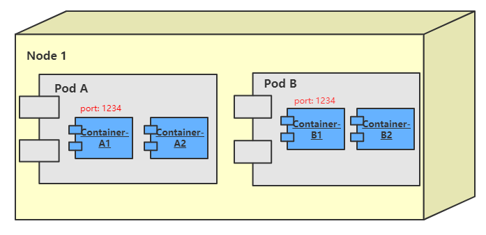

# 1 Kubernetes网络模型

Kubernetes 采用的是基于扁平地址空间的网络模型，集群中的每个Pod都有自己的IP地址，Pod之间不需要配置NAT就能直接通信。另外，同一个Pod中的容器共享Pod的IP，能够通过localhost通信。

这种网络模型对应用开发者和管理员相当友好，应用可以非常方便地从传统网络迁移到Kubernetes。每个Pod可被看作是一个个独立的系统，而Pod中的容器则可被看做同一系统中的不同进程。

k8s网络场景：

1. 容器与容器之间的直接通信。
2. Pod与Pod之间的通信。
3. Pod到Service之间的通信。
4. 集群外部与内部组件之间的通信。

## 1.1 Pod 内容器之间的通信

当Pod 被调度到某个节点，Pod 中所有的容器都在这个节点上运行，这些**容器共享相同的本地文件系统、IPC和网络命名空间**。

不同的Pod之间不存在端口冲突的问题，因为每个Pod都有自己的IP地址，当某个容器使用localhost时，意味着使用的是容器所属Pod 的地址空间。

比如Pod A有两个容器container-A1和container-A2，container-A1在端口1234上监听，当container-A2连接到localhost:1234 时，实际上就是在访问container-A1。这不同与统一节点上的Pod B 冲突，即使Pod B中的容器container-B1 也在监听 1234 端口。

## 1.2 Pod 之间的通信

Pod 的 IP 是集群可见的，即集群中的任何其他Pod和节点都可以通过IP直接与Pod通信，这种通信不需要借助任何网络地址转换、隧道或代理技术。

Pod 内部和外部使用的是同一个IP，这也意味着标准的命名服务和发现机制，比如DNS可以直接使用。

## 1.3 Pod 与 Service 通信

Pod 间可以直接通过IP地址通信，但前提是知道对方的IP。在Kubernetes集群中，Pod可能会频繁地创建和销毁，也就是说Pod的IP 是不固定的。

为了解决这个问题，Service 提供了访问Pod 的抽象层。无论后端的Pod 如何变化，Service 都作为稳定的前端对外提供服务。

同时，Service还提供高可用和负载均衡功能，Service 负载将请求转发给正确的Pod。

Service详解见： [Service](../Service.md)

## 1.4 外部访问

无论是Pod 的IP 还是Service 的ClusterIP，他们只能在Kubernetes 集群中可见，对集群之外的世界，这些IP都是私有的。

Kubernetes提供了两种方式让外界能够与Pod 通信：

1. NodePort：Service 通过Cluster节点的静态端口对外提供服务。外部可以通过<NodeIP>:<NodePort>访问Service。
2. LoadBalancer：Service 利用云供应商提供的load balancer 对外提供服务，云供应商负责将load balancer 的流量导向Service。目前支持的云供应商有GCP、AWS、Azur等。