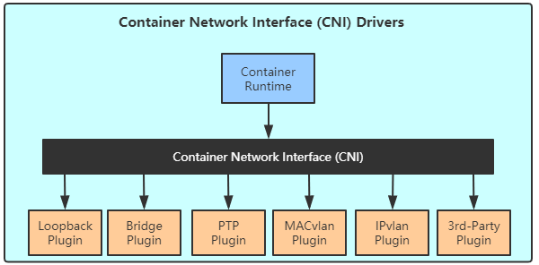

## 1 各种网络方案
有了网络模型，接着就是各种网络方案实现。

为了保证网络方案的标准化、扩展性和灵活性，Kubernetes 采用了 Container Networking Interface（CNI）规范。

CNI 是由CoreOS 提出的容器网络规范，使用了插件（Plugin）模型创建容器的网络栈：

CNI 的优点是支持多种容器 runtime，不仅仅是docker。CNI 的插件模型支持不同组织和公司开发的第三方插件，这对于运维人员来说很有吸引力，可以灵活选择适合的网络方案。

目前已有多种支持Kubernetes的网络方案，比如 Flannel、Calico、Canal、Weave Net 等。因为他们都实现了CNI规范，用户无论选择哪种方案，得到的网络模型都一样，即每个Pod都有独立的IP，可以直接通信。区别在于不同方案的底层实现不同，有的采用基于VxLan的 Overlay 实现，有的则是 Underlay，性能上有区别。再有就是是否支持Network Policy。