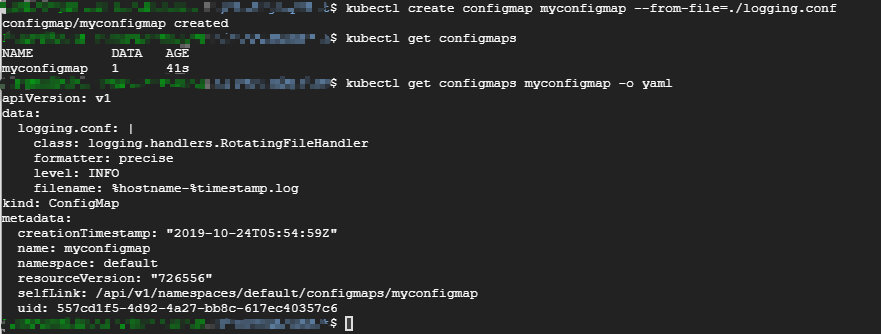

# 1 ConfigMap

Secret 可以为Pod提供密码、Token、私钥等敏感数据；对于一些非敏感数据，比如应用的配置信息，则可以用ConfigMap。

ConfigMap与Secret不同是的，数据以明文的形式存放

与Secret一样，ConfigMap 也支持四种创建方式

## 1.1 ConfigMap的创建

1. 通过 `--from-literal`

    ```bash
    $ kubectl create configmap myconfigmap --from-literal=config1=xxx --from-literal=config2=yyy
    ```

    每个 `--from-literal` 对应一个信息条目。


2. 通过 `--from-file`

    ```bash
    $ echo -n xxx > ./config1
    $ echo -n yyy > ./config2
    $ kubectl create configmap myconfigmap --from-file=./config1 --from-file=./config2
    ```

    每个 `--from-file` 对应一个文件，一个信息条目。

3. 通过 `--from-env-file`

    ```bash
    $ cat << EOF > env.txt
    config1=xxx
    config2=yyy
    EOF
    $ kubectl create configmap myconfigmap --from-env-file=env.txt
    ```

    文件`env.txt` 中每行 `Key=Value` 对应一个信息条目。

4. 通过 `YAML` 配置文件

    ```yaml
    apiVersion: v1
    kind: ConfigMap
    metadata:
      name: myconfigmap
    namespace: default
    data:
      config1: xxx
      config2: yyy
    ```

## 1.2 ConfigMap的使用

### 1.2.1 Volume 方式

```yaml
apiVersion: v1
kind: Pod
metadata:
  name: mypod
spec:
  containers:
    - name: test-container
      image: k8s.gcr.io/busybox
      command: [ "/bin/sh", "-c", "ls /etc/config/" ]
      volumeMounts:
      - name: foo
        mountPath: /etc/config
  volumes:
    - name: foo
      configMap:
        # Provide the name of the ConfigMap containing the files you want
        # to add to the container
        name: myconfigmap
  restartPolicy: Never
```

### 1.2.2 坏境变量方式

```yaml
apiVersion: v1
kind: Pod
metadata:
  name: mypod
spec:
  containers:
    - name: test-container
      image: k8s.gcr.io/busybox
      command: [ "/bin/sh", "-c", "env" ]
      env:
        - name: CONFIG_1
          valueFrom:
            configMapKeyRef:
              name: myconfigmap
              key: config1
        - name: CONFIG_2
          valueFrom:
            configMapKeyRef:
              name: myconfigmap
              key: config2
  restartPolicy: Never
```

大多数情况下，配置信息都以文件形式提供，所以在创建ConfigMap 时通常采用 `--from-file` 或 `YAML` 的方式，读取ConfigMap时通常采用 `Volume` 方式。

## 1.3 一个例子

`logging.conf` 文件中有日志配置信息如下：

```yaml
class: logging.handlers.RotatingFileHandler
formatter: precise
level: INFO
filename: %hostname-%timestamp.log
```

创建ConfigMap：

* 采用 `--from-file形式`:

    

* 采用 `YAML` 配置文件:

    ```yaml
    apiVersion: v1
    kind: ConfigMap
    metadata:
      name: myconfigmap
    namespace: default
    data:
      logging.conf: |
        class: logging.handlers.RotatingFileHandler
        formatter: precise
        level: INFO
        filename: %hostname-%timestamp.log
    ```

在Pod中使用此ConfigMap：

```yaml
apiVersion: v1
kind: Pod
metadata:
  name: mypod
spec:
  containers:
    - name: test-container
      image: k8s.gcr.io/busybox
      command: [ "/bin/sh", "-c", "ls /etc/config/" ]
      volumeMounts:
      - name: foo
        mountPath: /etc/config
  volumes:
    - name: foo
      configMap:
        name: myconfigmap
        items:
          - key: logging.conf
            path: myapp/logging.conf
  restartPolicy: Never
```

1. 在`volumes`中指定存放配置信息的文件相对路径为 `myapp/logging.conf`
2. 将volume `mount` 到容器的 `/etc/config` 的目录

```sh
# 创建Pod
$ kubectl apply -f mypod.yml

$ kubectl exec -it mypod sh
# cat /etc/config/myapp/logging.conf
class: logging.handlers.RotatingFileHandler
formatter: precise
level: INFO
filename: %hostname-%timestamp.log
# 
```

## 参考

* [Configure a Pod to Use a ConfigMap - Kubernetes](https://kubernetes.io/docs/tasks/configure-pod-container/configure-pod-configmap/)
* CloudMan. 每天 5 分钟玩转 Kubernetes[M]. 清华大学出版社, 2018.

