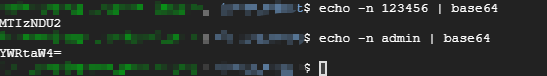
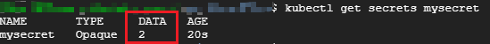
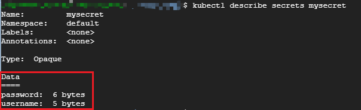
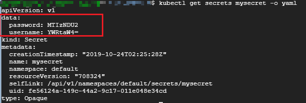
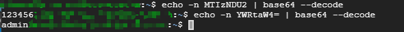

# 1 Secret

应用启动过程中可能需要一些敏感信息，比如访问数据库的用户名、密码或者秘钥。将这些信息直接保存在容器镜像中显然不妥，Kubernetes 提供的解决方案是Secret。

Secret 会以**密文的方式存储数据**，避免了直接在配置文件中保存敏感信息。

Secret 会**以Volume 的形式被mount到Pod**，容器可通过文件的方式使用Secret 中的敏感数据；此外，容器也可以以环境变量的方式使用这些数据。

Secret 可以通过命令行或YAML创建。

## 1.1 Secret 的创建

假设希望Secret包含：用户名 admin、密码 123456

1. 通过 `--from-literal`

    ```bash
    $ kubectl create secret generic mysecret --from-literal=username=admin --from-literal=password=123456
    ```

    每个 `--from-literal` 对应一个信息条目。

    ```
    特殊字符（例如 $, \* 和 ! ）需要转义。 如果使用的密码具有特殊字符，则需要使用 \\ 字符对其进行转义。 
    例如，如果你的实际密码是 S!B\*d$zDsb ，则应通过以下方式执行命令：

    $ kubectl create secret generic mysecret –-from-literal=username=admin –-from-literal=password=S\!B\\*d\$zDsb 
    ```

2. 通过 `--from-file`

    ```bash
    $ echo -n admin > ./username
    $ echo -n 123456 > ./password
    $ kubectl create secret generic mysecret --from-file=./username --from-file=./password
    ```

    每个 `--from-file` 对应一个文件，一个信息条目。

3. 通过 `--from-env-file`

    ```bash
    $ cat << EOF > env.txt
    username=admin
    passwoed =1234
    EOF
    $ kubectl create secret generic mysecret --from-env-file=env.txt
    ```

    文件`env.txt` 中每行 `Key=Value` 对应一个信息条目。

4. 通过 `YAML` 配置文件

    ```yaml
    apiVersion: v1
    kind: Secret
    metadata:
      name: mysecret
    type: Opaque
    data:
      username: YWRtaW4=
      password: MTIzNDU2
    ```

    文件中的敏感数据必须是通过base64编码后的结果

    

    执行 `kubectl apply -f mysecrete.yml` 创建Secret

## 1.2 查看Secret

1. 通过 `kubectl get secret ` 查看存在的secret

    

2. 通过 `kubectl describe secret mysecret` 查看条目的Key

    

3. 通过 `kubectl get secrets mysecret -o yaml` 获取 secret 的详细信息

    

4. 通过base64 解码 Secret 

    

## 1.3 编辑Secret

```bash
$ kubectl edit secrets mysecret

# 这将打开默认配置的编辑器，并允许更新 data 字段中的base64编码的 secret
```

## 1.4 在Pod 中使用Secret

Pod 使用Secret 的方式：
* Volume 
* 环境变量

### 1.4.1 Pod通过Volume使用 Secret

```yaml
apiVersion: v1
kind: Pod
metadata:
  name: mypod
spec:
  containers:
  - name: mypod
    image: redis
    volumeMounts:
    - name: foo
      mountPath: "/etc/foo"
      readOnly: true
  volumes:
  - name: foo
    secret:
      secretName: mysecret
```

1. pod 中定义 volume。可以给这个 volume 随意命名，它的 `spec.volumes[].secret.secretName ` 必须等于 secret 对象的名字。
2. 将 foo mount 到容器路径 `/etc/foo` ，指定读写权限为 `readOnly`

```bash
$ kubectl apply -f mypod.yml
$ kubectl exec -it mypod sh
#
# ls /etc/foo
password username
# cat /etc/foo/username
admin#
# cat /etc/foo/password
123456#
# exit
```

可以看到 Kubernetes 会在指定的路径 `/etc/foo` 下为每条敏感数据创建一个文件，文件名就是数据条目的Key，Value则以明文存放在文件中。

我们也可以自定义存放数据的文件名，修改yaml文件:

```yaml
apiVersion: v1
kind: Pod
metadata:
  name: mypod
spec:
  containers:
  - name: mypod
    image: redis
    volumeMounts:
    - name: foo
      mountPath: "/etc/foo"
      readOnly: true
  volumes:
  - name: foo
    secret:
      secretName: mysecret
      items:
      - key: username
        path: my-group/my-username
      - key: password
        path: my-group/my-password
```

这时数据将分别存储在 `/etc/foo/my-group/my-username` 和 `/etc/foo/my-group/my-password` 文件中而不是 `/etc/foo/username` 与 `/etc/foo/password` 中

> 如果使用了 spec.volumes[].secret.items，**只有在 items 中指定的 key 被映射**。要使用 secret 中所有的 key，所有这些都必须列在 items 字段中。所有列出的密钥必须存在于相应的 secret 中。否则，不会创建卷。

我们还可以指定secret文件权限，默认我0644。

1. 为整个保密卷指定默认模式

```yaml
apiVersion: v1
kind: Pod
metadata:
  name: mypod
spec:
  containers:
  - name: mypod
    image: redis
    volumeMounts:
    - name: foo
      mountPath: "/etc/foo"
  volumes:
  - name: foo
    secret:
      secretName: mysecret
      defaultMode: 256
```

secret 将被挂载到 `/etc/foo` 目录，所有通过该 secret volume 挂载创建的文件的权限都是 `0400`

2. 为不同的文件指定不同的权限

```yaml
apiVersion: v1
kind: Pod
metadata:
  name: mypod
spec:
  containers:
  - name: mypod
    image: redis
    volumeMounts:
    - name: foo
      mountPath: "/etc/foo"
  volumes:
  - name: foo
    secret:
      secretName: mysecret
      items:
      - key: username
        path: my-group/my-username
        mode: 511
```

`/etc/foo/my-group/my-username` 的文件的权限值为 0777

### 1.4.2 通过环境变量使用Secret

```yaml
apiVersion: v1
kind: Pod
metadata:
  name: secret-env-pod
spec:
  containers:
  - name: mycontainer
    image: redis
    env:
      - name: SECRET_USERNAME
        valueFrom:
          secretKeyRef:
            name: mysecret
            key: username
      - name: SECRET_PASSWORD
        valueFrom:
          secretKeyRef:
            name: mysecret
            key: password
  restartPolicy: Never
```

创建Pod 并读取Secret：

```bash
$ kubectl apply -f mypod-env.yml
$ kubectl exec -it secret-env-pod sh
# echo $SECRET_USERNAME
admin
# echo $SECRET_PASSWORD
123456
```

> 注意： 环境变量读取Secret很方便，但无法支撑Secret动态更新

## 参考

* [Secrets - Kubernetes](https://kubernetes.io/docs/concepts/configuration/secret/)
* CloudMan. 每天 5 分钟玩转 Kubernetes[M]. 清华大学出版社, 2018.