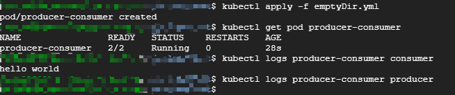

## 1 Volume

容器和Pod 是短暂的，他们的生命周期可能很短，会被频繁地创建和销毁。容器销毁时，保存在容器内部文件系统中的数据都会被清除。

为了持久化保存容器的数据，可以使用 Kubernetes Volume。

Volume 的生命周期独立于容器，Pod 中的容器可能被销毁和重建，但是Volume 会被保留。

本质上，Kubernetes Volume 是一个目录，这一点与 Docker Volume 类似。当Volume 被mount到Pod，Pod中的所有容器都可以访问到这个Volume。Kubernetes Volume也支持多种backend类型，包括emptyDir、hostPath、GCE Persistent Disk、AWS Elastic Block Store、NFS、Ceph等，完整列表可以参考https://kubernetes.io/docs/concepts/storage/volumes/#types-of-volumes

Volume 提供了对各种backend 的抽象，容器在使用Volume 读写数据的时候不需要关系数据到底是存放在本地节点的文件系统中还是云硬盘上。对它来说，所有类型的Volume 都只是一个目录。

### 1.1 Volume 的功能

1. Volume是Pod中能够被多个容器访问的共享目录，可以让容器的数据写到宿主机上或者写文件到网络存储中
2. Volume 的生命周期独立于容器，用于持久化保存容器的数据
3. 可以实现容器配置文件集中化定义与管理，通过ConfigMap资源对象来实现。

### 1.2 Volume 的特点

k8s中的Volume与Docker的Volume相似，但不完全相同。

1. k8s上Volume定义在Pod上，然后被一个Pod中的多个容器挂载到具体的文件目录下。
2. k8s的Volume与Pod生命周期相关而与容器的生命周期无关，即容器挂掉，数据不会丢失但是Pod挂掉，数据会丢失。
3. k8s中的Volume支持多种类型：Ceph、GlusterFS等分布式系统。

### 1.3 Volume 的使用方式

先在Pod上声明一个Volume，然后容器引用该Volume并Mount到容器的某个目录。

## 2 Volume 类型
### 2.1 emptyDir

当 Pod 指定到某个节点上时，首先创建的是一个 emptyDir Volume，并且只要 Pod 在该节点上运行，Volume就一直存在。

emptyDir 是最基础的Volume类型。一个emptyDir Volume 是Host 上的一个空目录。

emptyDir Volume 对于容器来说是持久的，对于Pod 则不是。当Pod从节点删除时。Volume 的内容也会被删除。但如果只是容器被销毁而Pod还在，则Volume不受影响。

也就是说：**emptyDir Volume 的生命周期与Pod 一致**。

Pod 中的所有容器都可以共享Volume，他们可以指定各自的mount 路径。

我们通过一个例子实践emptyDir，配置文件如下：

```yaml
apiVersion: v1
kind: Pod
metadata:
  name: producer-consumer
spec:
  containers:
  - image: busybox
    name: producer
    volumeMounts:
    - mountPath: /producer_dir
      name: shared-volume
    args:
    - /bin/sh
    - -c
    - echo "hello world" > /producer_dir/hello ; sleep 30000

  - image: busybox
    name: consumer
    volumeMounts:
    - mountPath: /consumer_dir
      name: shared-volume
    args:
    - /bin/sh
    - -c
    - cat /consumer_dir/hello ; sleep 30000

  volumes:
  - name: shared-volume
    emptyDir: {}
```

模拟了一个producer-consumer场景。Pod有两个容器producer 和 consumer，他们共享一个Volume。producer负责往Volume中写数据，consumer 则是从Volume中读取数据。

1. 文件最底部的volumes，定义了一个emptyDir类型的Volume **shared-volume**
2. producer 容器将**shared-volume** mount 到 **/producer_dir** 目录
3. producer 通过 echo 将数据写到文件hello 里
4. consumer 容器将**shared-volume** mount 到 **/consumer_dir** 目录
5. consumer 通过 cat 从文件hello 读数据

执行`kubectl apply` 创建Pod



`kubectl logs`显示容器consumer 成功读到了producer 写入的数据，验证了两个容器共享emptyDir Volume。

因为emptyDir 是 Docker Host 文件系统里的目录，其效果相当于执行了 `docker run -v /producer_dir` 和 `docker run -v /consumer_dir`。

emptyDir 是Host 上创建的临时目录，其优点是能够方便地为Pod中的容器提供共享存储，不需要额外的配置。他不具备持久性，如果Pod不存在了，emptyDir 也就没有了。根据这个特性，emptyDir特别适合Pod中的容器需要临时共享存储空间的场景，比如前面的生产者消费者用例。


> **emptyDir 的一些用途**：

> 1. 缓存空间，例如基于磁盘的归并排序。
> 2. 为耗时较长的计算任务提供检查点，以便任务能方便地从崩溃前状态恢复执行。
> 3. 在 Web 服务器容器服务数据时，保存内容管理器容器获取的文件。

### 2.2 hostPath

hostPath Volume 的作用是将Docker Host 文件系统中已经存在的目录 mount 给 Pod的容器，也就是在Pod上挂载宿主机上的文件或目录。大部分应用都不会使用hostPath Volume，因为这实际上增加了Pod 与 节点的耦合，限制了Pod 的使用。不过那些需要访问Kubernetes 或 Docker 内部数据（配置文件和二进制库）的应用则需要使用hostPath。

比如 kube-apiserver 和 kube-controller-manager 就是这样的应用，通过 `kubectl edit --namespace=kube-system pod <your-kube-apiserver> ` 查看 kube-apiserver Pod 的配置。

作用：

1. 容器应用日志需要持久化时，可以使用宿主机的高速文件系统进行存储
2. 需要访问宿主机上Docker引擎内部数据结构的容器应用时，可以通过定义hostPath为宿主机/var/lib/docker目录，使容器内部应用可以直接访问Docker的文件系统。

### 2.3 外部Storage Provider

如果Kubernetes 部署在诸如 AWS、GCE、Azure 等公有云上，可以直接使用云硬盘作为Volume。

下面是一个AWS Elastic Block Store 配置示例：

```yaml
apiVersion: v1
kind: Pod
metadata:
  name: test-ebs
spec:
  containers:
  - image: k8s.gcr.io/test-webserver
    name: test-container
    volumeMounts:
    - mountPath: /test-ebs
      name: test-volume
  volumes:
  - name: test-volume
    # This AWS EBS volume must already exist.
    awsElasticBlockStore:
      volumeID: <volume-id>
      fsType: ext4
```

要在Pod 中使用ESB Volume，必须先在AWS 中创建，然后通过<volume-id> 引用。其他云硬盘的使用方法可参考各公有云厂商的官方文档以及相关Kubernetes 官网https://kubernetes.io/docs/concepts/storage/volumes/#types-of-volumes。
