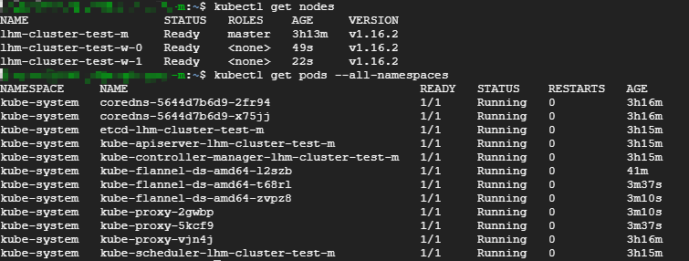

# 2019最新从零开始搭建Kubernetes集群 (Debian k8s 搭建)
## 1 实验环境

将部署三个节点的Kubernetes Cluster，一台Master，两台Node

所有节点的操作系统均为Debian9

官方的安装文档可以参考 https://kubernetes.io/docs/setup/production-environment/tools/kubeadm/install-kubeadm/

注意，Kubernetes 几乎所有的安装组件和Docker镜像都放在Google自己的网站上，建议网络障碍都必须想办法克服。

## 2 安装Docker

[官方文档](https://docs.docker.com/install/linux/docker-ce/debian/)

**Master、Node节点都需要安装、配置Docker**

### 2.1 使用 APT 安装

```bash
# 卸载原来的docker
$ sudo apt-get remove docker docker-engine docker.io containerd runc

# 由于 apt 源使用 HTTPS 以确保软件下载过程中不被篡改。因此，我们首先需要添加使用 HTTPS 传输的软件包以及 CA 证书。
# 安装依赖
$ sudo apt-get update && sudo apt-get install -y \
    apt-transport-https \
    ca-certificates \
    curl \
    gnupg2 \
    software-properties-common

# 添加软件源的 GPG 密钥
# 鉴于国内网络问题，建议使用国内源，官方源请在注释中查看。
$ sudo curl -fsSL https://mirrors.ustc.edu.cn/docker-ce/linux/debian/gpg | sudo apt-key add -
# 官方源 ：
# $ sudo curl -fsSL https://download.docker.com/linux/debian/gpg | sudo apt-key add -

# 验证是否拥有秘钥
$ sudo apt-key fingerprint 0EBFCD88
#pub   rsa4096 2017-02-22 [SCEA]
#      9DC8 5822 9FC7 DD38 854A  E2D8 8D81 803C 0EBF CD88
#uid          [ unknown] Docker Release (CE deb) <docker@docker.com>
#sub   rsa4096 2017-02-22 [S]

# 向 source.list 中添加 Docker CE 软件源
$ sudo add-apt-repository \
   "deb [arch=amd64] https://mirrors.ustc.edu.cn/docker-ce/linux/debian \
   $(lsb_release -cs) \
   stable"
# 官方源
# $ sudo add-apt-repository \
#    "deb [arch=amd64] https://download.docker.com/linux/debian \
#    $(lsb_release -cs) \
#    stable"

# 安装 Docker CE
$ sudo apt-get update
$ sudo apt-get  install -y  docker-ce docker-ce-cli containerd.io

# 查看docker版本
$ docker --version
# Docker version 19.03.3, build a872fc2f86

# 启动Docker CE 并设置开机启动
$ sudo systemctl enable docker
$ sudo systemctl start docker
```

### 2.2 使用脚本自动安装

为了简化安装流程，官方提供脚本一键安装：

```bash 
$ curl -fsSL https://get.docker.com -o get-docker.sh
$ sudo sh get-docker.sh
```

### 2.3 建立 docker 用户组

默认情况下，docker 命令会使用 Unix socket 与 Docker 引擎通讯。而只有 root 用户和 docker 组的用户才可以访问 Docker 引擎的 Unix socket。出于安全考虑，一般 Linux 系统上不会直接使用 root 用户。因此，更好地做法是将需要使用 docker 的用户加入 docker 用户组。

```bash
#建立 docker 组：
$ sudo groupadd docker

#将当前用户加入 docker 组：
$ sudo usermod -aG docker $USER
```

### 2.4 测试 Docker 是否安装正确

退出当前终端并重新登录

```bash
$ docker run hello-world

Unable to find image 'hello-world:latest' locally
latest: Pulling from library/hello-world
1b930d010525: Pull complete 
Digest: sha256:c3b4ada4687bbaa170745b3e4dd8ac3f194ca95b2d0518b417fb47e5879d9b5f
Status: Downloaded newer image for hello-world:latest
Hello from Docker!
This message shows that your installation appears to be working correctly.
To generate this message, Docker took the following steps:
 1. The Docker client contacted the Docker daemon.
 2. The Docker daemon pulled the "hello-world" image from the Docker Hub.
    (amd64)
 3. The Docker daemon created a new container from that image which runs the
    executable that produces the output you are currently reading.
 4. The Docker daemon streamed that output to the Docker client, which sent it
    to your terminal.
To try something more ambitious, you can run an Ubuntu container with:
 $ docker run -it ubuntu bash
Share images, automate workflows, and more with a free Docker ID:
 https://hub.docker.com/
For more examples and ideas, visit:
 https://docs.docker.com/get-started/
```

## 3 安装Kubernetes组件

**master、node节点都需要安装kubelet kubeadm kubectl !!! **

[官方文档](https://kubernetes.io/docs/setup/production-environment/tools/kubeadm/install-kubeadm/)

* kubelet 运行在Cluster所有节点上，负责启动Pod 和容器
* kubeadm 用于初始化Cluster
* kubectl 是Kubernetes命令行工具。通过kubectl可以部署和管理应用，查看各种资源，创建、删除和更新各种组件。

### 3.1 配置K8S的yum源

k8s官网给的yum源是 packages.cloud.google.com，国内访问不了，建议使用阿里云的yum仓库

```bash 
$ sudo cat /etc/apt/sources.list
# 系统安装源
deb http://mirrors.aliyun.com/ubuntu/ xenial main restricted
deb http://mirrors.aliyun.com/ubuntu/ xenial-updates main restricted
deb http://mirrors.aliyun.com/ubuntu/ xenial universe
deb http://mirrors.aliyun.com/ubuntu/ xenial-updates universe
deb http://mirrors.aliyun.com/ubuntu/ xenial multiverse
deb http://mirrors.aliyun.com/ubuntu/ xenial-updates multiverse
deb http://mirrors.aliyun.com/ubuntu/ xenial-backports main restricted universe multiverse
# kubeadm及kubernetes组件安装源
deb https://mirrors.aliyun.com/kubernetes/apt kubernetes-xenial main
```


### 3.2 关闭Swap

```bash
$ swapoff -a
$ sed -i '/ swap / s/^/#/' /etc/fstab
```

### 3.3 关闭SeLinux

Debian默认没有安装Selinux

### 3.4 确保iptables工具不使用nftables后端

```bash
$ update-alternatives --set iptables /usr/sbin/iptables-legacy
$ update-alternatives --set ip6tables /usr/sbin/ip6tables-legacy
$ update-alternatives --set arptables /usr/sbin/arptables-legacy
$ update-alternatives --set ebtables /usr/sbin/ebtables-legacy
```

### 3.5 安装K8S组件(kubelet kubeadm kubectl)

* 使用阿里云源

    ```bash
    sudo apt-get update # 更新源，可以不理会gpg的报错信息
    sudo apt-get install -y kubelet kubeadm kubectl kubernetes-cni --allow-unauthenticated  # 强制安装
    ```

* 官方

    ```bash
    $ sudo curl -s https://packages.cloud.google.com/apt/doc/apt-key.gpg | sudo apt-key add -
    $ sudo vim /etc/apt/sources.list.d/kubernetes.list
    # 复制以下内容到文件中并保存
    # 官方源
    deb http://apt.kubernetes.io/ kubernetes-xenial main

    $ sudo apt-get update
    $ sudo apt-get install -y kubelet kubeadm kubectl kubernetes-cni
    # $ sudo apt-mark hold kubelet kubeadm kubectl kubernetes-cni 
    ```

### 3.6 配置kubelet的cgroup drive

参考：https://kubernetes.io/docs/setup/production-environment/container-runtimes/#docker

确保docker 的cgroup drive 和kubelet的cgroup drive一样：

```bash
$ docker info | grep -i cgroup
$ sudo cat /etc/systemd/system/kubelet.service.d/10-kubeadm.conf

# 若显示不一样，则执行：
修改/etc/systemd/system/kubelet.service.d/10-kubeadm.conf文件，增加--cgroup-driver=cgroupfs

Environment="KUBELET_KUBECONFIG_ARGS=--bootstrap-kubeconfig=/etc/kubernetes/bootstrap-kubelet.conf --kubeconfig=/etc/kubernetes/kubelet.conf --cgroup-driver=cgroupfs"

$ sudo systemctl daemon-reload
```

### 3.7 使用kubeadm 初始化master节点

```bash
$ sudo kubeadm init --pod-network-cidr=10.244.0.0/16 --apiserver-advertise-address=10.138.0.3
# --apiserver-advertise-address master的IP地址，指定与其它节点通信的接口
```

--apiserver-advertise-address 指明用Master的哪个interface与Cluster的其他节点通信，如果Master有多个interface，建议明确指定，如果不指定，kubeadm 会自动选择有默认网关的interface。

--pod-network-cidr 指定Pod网络的范围。Kubernetes 支持多种网络方案，而且不同网络方案对--pod-network-cidr 有自己的要求，这里设置为10.244.0.0/16 是因为将使用flannel网络方案，必须设置成这个CIDR。

拉取集群所需镜像的过程涉及翻墙，默认访问谷歌的服务器
不能翻墙的话，可以尝试以下办法：下载我导出的镜像包，[镜像网盘链接](https://pan.baidu.com/s/1YCO-8AEfqqYzAWsx9mUpTQ&shfl=sharepset)，解压缩以后是多个tar包，使用`docker load< xxxx.tar `导入各个文件即可。

**执行过程：**

1. kubeadm 执行初始化前的检查
2. 生成token和证书
3. 生成KubeConfig文件，kubelet需要用这个文件与Master通信
4. 安装Master组件，会从Google的Registry下载组件的Docker镜像
5. 安装附加组件Kube-proxy和kube-dns
6. Kubernetes Master初始化成功
7. 提示如何配置Kubectl，后面会实践
8. 提示如何安装Pod网络，后面会实践
9. 提示如何注册其他节点到Cluster，后面会实践。
   
执行结果:


### 3.8 配置kubectl

```bash
  $ mkdir -p $HOME/.kube
  $ sudo cp -i /etc/kubernetes/admin.conf $HOME/.kube/config
  $ sudo chown $(id -u):$(id -g) $HOME/.kube/config
```

为了使用更便捷，启用kubectl 命令的自动补全功能：

```bash
echo 'source <(kubectl completion bash)' >> ~/.bashrc
```

这样master的节点就配置好了，并且可以使用kubectl来进行各种操作了，根据上面的提示接着往下做，将slave节点加入到集群。

### 3.9 创建网络

```bash
$ sudo kubectl apply -f https://raw.githubusercontent.com/coreos/flannel/master/Documentation/kube-flannel.yml


$ sudo kubectl apply -f https://raw.githubusercontent.com/coreos/flannel/master/Documentation/k8s-manifests/kube-flannel-rbac.yml

# 查看所有Pod
$ sudo kubectl get pods --all-namespaces
# 所有Pod一旦创建并启动运行。 你应该看到类似下面的内容。
```


### 3.10 Slave节点加入集群

```bash
# node1:
sudo kubeadm join 10.138.0.34:6443 --token 2eq3f7.aiwd0iqtqtjsthte \
    --discovery-token-ca-cert-hash sha256:4b68a6f74b2ade2d58d9bdf4b43269aee27b78bb0f12d524ee1d4eaaebf5ce08

# node2:
sudo kubeadm join 10.138.0.34:6443 --token 2eq3f7.aiwd0iqtqtjsthte \
    --discovery-token-ca-cert-hash sha256:4b68a6f74b2ade2d58d9bdf4b43269aee27b78bb0f12d524ee1d4eaaebf5ce08
```

输出日志


master:



### 3.11 将Master作为工作节点

让master也运行pod（默认master不运行pod）,这样在测试环境做是可以的，不建议在生产环境如此操作。
如果希望将k8s-master也当作Node使用，可以执行如下命令：

```bash
$ kubectl taint nodes --all node-role.kubernetes.io/master-
# node "ubuntu-master" untainted
# taint "node-role.kubernetes.io/master:" not found
# taint "node-role.kubernetes.io/master:" not found
# taint "node-role.kubernetes.io/master:" not found
```

如果要恢复Master Only的状态，执行：

`kubectl taint node lhm-cluster-test-m node-role.kubernetes.io/master="":NoSchedule`


## 参考：

* [Get Docker Engine - Community for Debian](https://docs.docker.com/install/linux/docker-ce/debian/)
* [Installing kubeadm](https://kubernetes.io/docs/setup/production-environment/tools/kubeadm/install-kubeadm/)
* [Setup Kubernetes Cluster with Ubuntu 16.04](https://blog.tekspace.io/setup-kubernetes-cluster-with-ubuntu-16-04/)
* CloudMan. 每天 5 分钟玩转 Kubernetes[M]. 清华大学出版社, 2018.

    