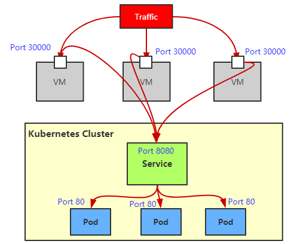
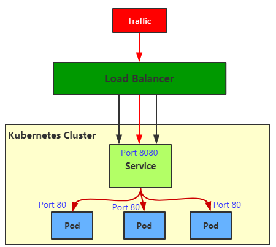
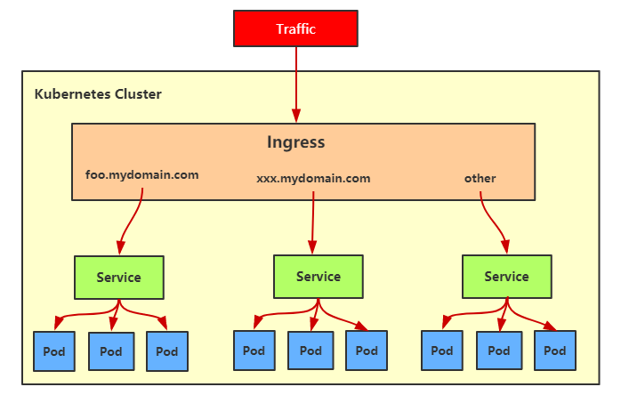

## 1 深入剖析k8s之外部访问service

通过[Service 工作原理](Service.md) 的介绍，你应该能够明白这样一个事实：Service 的访问信息在 Kubernetes 集群之外，其实是无效的。

这其实也容易理解：所谓 Service 的访问入口，其实就是每台宿主机上由 kube-proxy 生成的 iptables 规则，以及 kube-dns 生成的 DNS 记录。而一旦离开了这个集群，这些信息对用户来说，也就自然没有作用了。

所以，在使用 Kubernetes 的 Service 时，一个必须要面对和解决的问题就是：**如何从外部（Kubernetes 集群之外），访问到 Kubernetes 里创建的 Service？**

### 1.1 NodePort

NodePort 在 Kubenretes 里是一个广泛应用的服务暴露方式。基于 ClusterIP 提供的功能，为 Service 在 Kubernetes 集群的每个节点上绑定一个端口，即 NodePort。集群外部可基于任何一个 NodeIP:NodePort 的形式来访问 Service。Service 在每个节点的 NodePort 端口上都是可用的。详见[Service 1.5.1 NodePort](Service.md)



### 1.2 LoadBalancer

`LoadBalancer` 是基于 `NodePort` 和云服务供应商提供的外部负载均衡器，**适用于公有云上的 Kubernetes 服务**。通过这个外部负载均衡器将外部请求转发到各个 `NodeIP:NodePort` 以实现对外暴露服务。



`LoadBalancer` 只能在 `Service` 上定义。`LoadBalancer` 是一些特定公有云提供的负载均衡器，需要特定的云服务商支持。比如：AWS、Azure、OpenStack 和 GCE (Google Container Engine) 。

```yaml
kind: Service
apiVersion: v1
metadata:
  name: example-service
spec:
  ports:
  - port: 8765
    targetPort: 9376
  selector:
    app: example
  type: LoadBalancer
```

在公有云提供的 Kubernetes 服务里，都使用了一个叫作 CloudProvider 的转接层，来跟公有云本身的 API 进行对接。所以，在上述 LoadBalancer 类型的 Service 被提交后，Kubernetes 就会调用 CloudProvider 在公有云上为你创建一个负载均衡服务，并且把被代理的 Pod 的 IP 地址配置给负载均衡服务做后端。

`LoadBalancer` 这种方式最大的不足就是每个暴露的服务需要使用一个公有云提供的负载均衡器 IP，这可能会付出比较大的成本代价。

```sh
$ kubectl get svc example-service
NAME              CLUSTER-IP     EXTERNAL-IP     PORT(S)          AGE
example-service   10.99.38.253   10.13.242.236   8765:30051/TCP   39s
```

集群内部可以使用 `ClusterIP` 加端口来访问服务，如：`10.99.38.253:8765`。

外部可以用以下两种方式访问该服务：

1. 使用任一节点的 IP 加 `30051` 端口访问该服务。

2. 使用 EXTERNAL-IP 来访问，这是一个 `VIP`，是云供应商提供的**负载均衡器 IP**，如：`10.13.242.236:8765`。


从上面几种 Service 的类型的结论来看，目前 Service 提供的负载均衡功能在使用上有以下限制：

1. 只提供 4 层负载均衡，不支持 7 层负载均衡功能，比如：不能按需要的匹配规则自定义转发请求。
2. 使用 NodePort 类型的 Service，需要在集群外部部署一个外部的负载均衡器。
3. 使用 LoadBalancer 类型的 Service，Kubernetes 必须运行在特定的云服务上。

### 1.3 Ingress

与 Service 不同，Ingress 实际上不是一种服务。相反，它位于多个服务之前，充当集群中的智能路由器或入口点。

`Ingress` 是自 Kubernetes 1.1 版本后引入的资源类型。Ingress 支持将 Service 暴露到 Kubernetes 集群外，同时可以自定义 Service 的访问策略。Ingress 能够把 Service 配置成外网能够访问的 URL，也支持提供按域名访问的虚拟主机功能。例如，通过负载均衡器实现不同的二级域名到不同 Service 的访问。



实际上 Ingress 只是一个统称，其由 `Ingress` 和 `Ingress Controller` 两部分组成。`Ingress` 用作将原来需要手动配置的规则抽象成一个 Ingress 对象，使用 YAML 格式的文件来创建和管理。`Ingress Controller` 用作通过与 Kubernetes API 交互，动态的去感知集群中 Ingress 规则变化。

使用 `Ingress` 前必须要先部署 `Ingress Controller`，`Ingress Controller` 是以一种插件的形式提供。`Ingress Controller` 通常是部署在 Kubernetes 之上的 `Docker` 容器，Ingress Controller 的 Docker 镜像里包含一个像 `Nginx` 或 `HAProxy` 的负载均衡器和一个 `Ingress Controller`。`Ingress Controller` 会从 Kubernetes 接收所需的 `Ingress` 配置，然后动态生成一个 `Nginx` 或 `HAProxy` 配置文件，并重新启动负载均衡器进程以使更改生效。换句话说，`Ingress Controller` 是由 Kubernetes 管理的负载均衡器。

> 注：无论使用何种负载均衡软件（ 比如：Nginx、HAProxy、Traefik等）来实现 Ingress Controller，官方都将其统称为 Ingress Controller。

Kubernetes Ingress 提供了负载均衡器的典型特性：HTTP 路由、粘性会话、SSL 终止、SSL直通、TCP 和 UDP 负载平衡等。

外部可通过 `foo.yourdomain.com` 或者 `xxx.mydomain.com` 两个不同 URL 来访问对应的后端服务，然后 `Ingress Controller` 直接将流量转发给后端 `Pod`，不需再经过 `Kube-Proxy` 的转发，这种方式比 `LoadBalancer` 更高效。

总的来说 Ingress 是一个非常灵活和越来越得到厂商支持的服务暴露方式，包括：Nginx、HAProxy、Traefik、还有各种 Service Mesh，而其它服务暴露方式更适用于服务调试、特殊应用的部署。